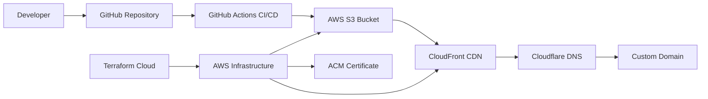

# Static Portfolio Website - AWS Cloud Infrastructure

**Professional 3D Portfolio with Full-Stack Cloud Architecture**

A production-ready static website showcasing modern web development and cloud engineering skills, featuring automated CI/CD, Infrastructure as Code, and enterprise-grade security.

## 🎯 Quick Overview for Recruiters

**Key Technical Highlights:**

- **Frontend:** React + Three.js + Vite (Modern JavaScript stack)
- **Cloud Infrastructure:** AWS S3, CloudFront, ACM, IAM
- **Infrastructure as Code:** Terraform with multi-provider setup
- **CI/CD:** GitHub Actions with automated deployment
- **DNS & Security:** Cloudflare integration with SSL/TLS
- **Performance:** Global CDN, optimized builds, responsive design

**Live Demo:** [View Portfolio](https://portfolio.omesh.site) | **Source Code:** [GitHub Repository](https://github.com/omesh7/aws-portfolio)

---

## 🏗️ Architecture Overview



**Data Flow:**

1. Code push triggers GitHub Actions workflow
2. Vite builds optimized React application
3. Assets deployed to S3 via automated sync
4. CloudFront serves content globally with caching
5. Cloudflare provides DNS resolution and additional security

---

## 💼 Technical Implementation

### Frontend Stack

- **React 19** - Modern component architecture
- **Three.js & React Three Fiber** - 3D graphics and animations
- **Tailwind CSS 4.0** - Utility-first styling
- **GSAP** - Professional animations
- **Vite** - Fast build tool and development server
- **EmailJS** - Contact form integration

### Cloud Infrastructure (AWS)

- **S3 Static Website Hosting** - Scalable storage with website configuration
- **CloudFront Distribution** - Global CDN with 400+ edge locations
- **ACM SSL Certificate** - Automated certificate management
- **IAM Policies** - Least-privilege access control
- **Origin Access Control** - Secure S3 access

### Infrastructure as Code

- **Terraform** - Multi-provider infrastructure management
- **Terraform Cloud** - Remote state management and collaboration
- **AWS Provider** - Complete AWS resource management
- **Cloudflare Provider** - DNS and security configuration

### DevOps & CI/CD

- **GitHub Actions** - Automated deployment pipeline
- **Node.js 18** - Modern runtime environment
- **Automated Testing** - Build verification and deployment
- **Environment Variables** - Secure configuration management

---

## 📁 Project Structure

```
01-static-website-s3/
├── infrastructure/              # Terraform Infrastructure
│   ├── main.tf                 # Core AWS resources
│   ├── providers.tf            # Provider configurations
│   ├── variables.tf            # Input variables
│   ├── outputs.tf              # Resource outputs
│   └── .terraform.lock.hcl     # Provider version lock
├── site/                       # React Application
│   ├── src/
│   │   ├── components/         # Reusable UI components
│   │   ├── sections/           # Page sections
│   │   ├── constants/          # Configuration data
│   │   └── App.jsx            # Main application
│   ├── public/                 # Static assets
│   ├── package.json           # Dependencies & scripts
│   └── vite.config.js         # Build configuration
└── .github/workflows/          # CI/CD Pipeline
    └── 01-static-website-deploy.yaml
```

---

## 🚀 Deployment Pipeline

### Automated CI/CD Workflow

**Trigger Conditions:**

- Push to `main` branch with changes in `01-static-website-s3/site/**`
- Manual workflow dispatch

**Pipeline Steps:**

1. **Environment Setup** - Ubuntu latest, Node.js 18
2. **Dependency Installation** - npm install with package-lock.json
3. **Build Process** - Vite production build with environment variables
4. **Build Verification** - Automated output validation
5. **S3 Deployment** - Sync to S3 with `--delete` flag for cleanup

**Environment Variables:**

```yaml
VITE_APP_EMAILJS_SERVICE_ID: ${{ secrets.VITE_APP_EMAILJS_SERVICE_ID }}
VITE_APP_EMAILJS_TEMPLATE_ID: ${{ secrets.VITE_APP_EMAILJS_TEMPLATE_ID_PROJECT_01_STATIC_SITE }}
VITE_APP_EMAILJS_PUBLIC_KEY: ${{ secrets.VITE_APP_EMAILJS_PUBLIC_KEY }}
```

### Infrastructure Provisioning

**Terraform Resources:**

- S3 bucket with static website configuration
- CloudFront distribution with custom domain
- ACM certificate with DNS validation
- IAM policies for secure access
- Cloudflare DNS records and CAA records

---

## 🔧 Technical Configuration

### Required GitHub Secrets

```
AWS_ACCESS_KEY_ID              # AWS programmatic access
AWS_SECRET_ACCESS_KEY          # AWS secret key
AWS_REGION                     # Target AWS region
S3_BUCKET_NAME_STATIC_PROJECT_01  # S3 bucket identifier
VITE_APP_EMAILJS_SERVICE_ID    # EmailJS service configuration
VITE_APP_EMAILJS_TEMPLATE_ID_PROJECT_01_STATIC_SITE  # Email template
VITE_APP_EMAILJS_PUBLIC_KEY    # EmailJS public key
```

### Terraform Variables

```hcl
variable "project_name" {
  description = "Project identifier for resource naming"
  type        = string
}

variable "cloudflare_zone_id" {
  description = "Cloudflare zone identifier"
  type        = string
}

variable "subdomain" {
  description = "Subdomain for the website"
  type        = string
}
```

---

## 🛡️ Security Implementation

### AWS Security Features

- **Origin Access Control (OAC)** - Restricts direct S3 access
- **S3 Bucket Policy** - CloudFront-only access with GitHub CI/CD permissions
- **IAM Least Privilege** - Minimal required permissions
- **SSL/TLS Encryption** - ACM certificate with TLS 1.2+
- **Server-Side Encryption** - AES256 encryption for S3 objects

### Cloudflare Security

- **DDoS Protection** - Automatic threat mitigation
- **SSL/TLS Termination** - Additional encryption layer
- **CAA Records** - Certificate authority authorization
- **Proxied DNS** - Hide origin server details

---

## 📊 Performance Optimizations

### Frontend Optimizations

- **Vite Build Optimization** - Tree shaking, code splitting
- **Asset Compression** - Gzip/Brotli compression
- **Image Optimization** - WebP format, lazy loading
- **Bundle Analysis** - Optimized chunk sizes

### CDN Configuration

- **CloudFront Caching** - Optimized cache behaviors
- **Edge Locations** - 400+ global points of presence
- **Compression** - Automatic gzip compression
- **HTTP/2 Support** - Modern protocol support

### Monitoring & Analytics

- **CloudFront Metrics** - Request count, cache hit ratio, error rates
- **S3 Metrics** - Storage usage, request metrics
- **Real User Monitoring** - Performance tracking

---

## 🚀 Local Development

### Prerequisites

- Node.js 18+ (LTS recommended)
- npm or yarn package manager
- AWS CLI configured
- Terraform CLI (optional)

### Quick Start

```bash
# Clone repository
git clone <repository-url>
cd 01-static-website-s3/site

# Install dependencies
npm install

# Start development server
npm run dev

# Build for production
npm run build

# Preview production build
npm run preview
```

### Development Commands

```bash
# Lint code
npm run lint

# Build with environment variables
VITE_APP_EMAILJS_SERVICE_ID=your_service_id npm run build

# Verify build output
ls -la dist/
```

---

## 💰 Cost Analysis

### AWS Costs (Monthly Estimates)

- **S3 Storage** - $0.023/GB (first 50TB)
- **S3 Requests** - $0.0004/1000 GET requests
- **CloudFront** - $0.085/GB (first 10TB)
- **ACM Certificate** - Free for AWS resources
- **Data Transfer** - $0.09/GB (after free tier)

**Estimated Monthly Cost:** $1-5 for typical portfolio traffic

### Cloudflare Costs

- **DNS Management** - Free tier available
- **CDN Services** - Free tier with 100GB bandwidth
- **SSL Certificate** - Free with Cloudflare

---

## 🔍 Troubleshooting Guide

### Common Issues & Solutions

**Build Failures:**

```bash
# Check Node.js version
node --version  # Should be 18+

# Clear npm cache
npm cache clean --force

# Reinstall dependencies
rm -rf node_modules package-lock.json
npm install
```

**Deployment Issues:**

```bash
# Verify AWS credentials
aws sts get-caller-identity

# Check S3 bucket access
aws s3 ls s3://your-bucket-name

# Test S3 sync manually
aws s3 sync ./dist s3://your-bucket-name --delete
```

**CloudFront Issues:**

- Distribution updates take 15-20 minutes
- Clear cache via AWS Console if needed
- Check origin access control configuration

---

## 📈 Future Enhancements

### Planned Improvements

- **Monitoring Dashboard** - CloudWatch custom dashboard
- **A/B Testing** - CloudFront functions for testing
- **Performance Budgets** - Automated performance monitoring
- **SEO Optimization** - Meta tags and structured data
- **Analytics Integration** - Google Analytics 4

### Scalability Considerations

- **Multi-region Deployment** - Global infrastructure
- **Blue-Green Deployments** - Zero-downtime updates
- **Automated Rollbacks** - Deployment safety
- **Load Testing** - Performance validation

---

## 📚 Technical Resources

### Documentation

- [AWS S3 Static Website Hosting](https://docs.aws.amazon.com/AmazonS3/latest/userguide/WebsiteHosting.html)
- [CloudFront Developer Guide](https://docs.aws.amazon.com/cloudfront/)
- [Terraform AWS Provider](https://registry.terraform.io/providers/hashicorp/aws/latest/docs)
- [Vite Build Guide](https://vitejs.dev/guide/build.html)
- [GitHub Actions Documentation](https://docs.github.com/en/actions)

### Best Practices

- [AWS Well-Architected Framework](https://aws.amazon.com/architecture/well-architected/)
- [Terraform Best Practices](https://www.terraform.io/docs/cloud/guides/recommended-practices/index.html)
- [React Performance Optimization](https://react.dev/learn/render-and-commit)

---

**Project Demonstrates:** Cloud Architecture, Infrastructure as Code, CI/CD Pipelines, Modern Frontend Development, Security Best Practices, Performance Optimization, and DevOps Methodologies.
