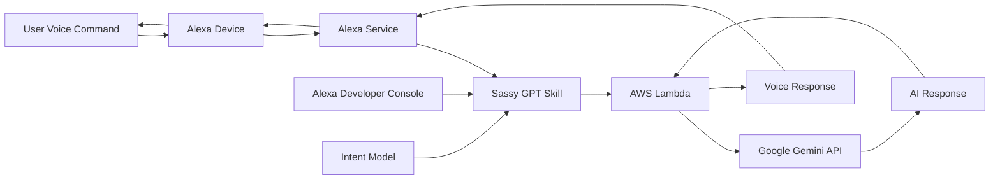

# Custom Alexa Skill - Sassy GPT

**AI-Powered Voice Assistant with Personality**

A production-ready Alexa skill that integrates Google Gemini AI to provide sassy, witty responses to user queries, demonstrating voice interface development, external API integration, and conversational AI implementation.

## 🎯 Quick Overview for Recruiters

**Key Technical Highlights:**
- **Voice Interface:** Alexa Skills Kit (ASK) with custom intents
- **AI Integration:** Google Gemini 1.5 Flash API for intelligent responses
- **Backend:** Node.js Lambda function with synchronous API calls
- **Conversational AI:** Natural language processing with personality
- **Voice UX:** Interactive voice experience with follow-up prompts
- **Deployment:** Serverless architecture with multi-region support

**Live Demo:** "Alexa, open Sassy me" then say anything | **Source Code:** [GitHub Repository](https://github.com/omesh7/aws-portfolio)

---

## 🏗️ Architecture Overview



**Voice Interaction Flow:**
1. User speaks to Alexa device
2. Alexa service processes speech-to-text
3. Custom skill receives intent with user input
4. Lambda function calls Google Gemini API with "sassy" prompt
5. AI generates witty response
6. Response converted to speech and delivered to user

---

## 💼 Technical Implementation

### Voice Interface Stack
- **Alexa Skills Kit (ASK)** - Voice interface framework
- **HelloWorldIntent** - Main intent with CatchAll slot
- **AMAZON.SearchQuery** - Captures any user input
- **Multi-region Deployment** - NA, EU, FE regions
- **Session Management** - Conversation flow handling

### Backend Stack
- **Node.js 18** - Lambda runtime environment
- **AWS Lambda** - Serverless compute with multi-region support
- **Google Gemini 1.5 Flash** - AI response generation
- **sync-request** - Synchronous HTTP requests
- **Error Handling** - Graceful API failure responses

### AI Integration
- **Google Gemini API** - Advanced language model
- **Personality Prompting** - "Sassy and mean" response style
- **Real-time Processing** - Synchronous API calls
- **Response Parsing** - JSON response handling

---

## 📁 Project Structure

```
03-custom-alexa-skill/
├── lambda/                     # Lambda Function Code
│   ├── index.js               # Main skill handler with Gemini integration
│   ├── config.js              # API key configuration
│   ├── package.json           # Dependencies (ask-sdk-core, sync-request)
│   ├── util.js                # S3 utility functions
│   └── local-debugger.js      # Local testing utility
├── interactionModels/          # Voice Interface Models
│   └── custom/
│       └── en-US.json         # English language model
├── skill.json                 # Skill manifest with multi-region endpoints
├── architecture-diagram/       # Architecture diagrams
└── README.md                  # This documentation
```

---

## 🎤 Voice Interface Design

### Skill Invocation
```
User: "Alexa, open Sassy me"
Alexa: "Which Intent do you want - say hello to start"
```

### Main Intent - HelloWorldIntent

**Casual Conversation:**
```
User: "Hello"
Alexa: [Sassy AI-generated response from Gemini]
```

**Any Question:**
```
User: "How are you?"
Alexa: [Witty, slightly mean response generated by AI]
```

**Follow-up:**
```
User: "Tell me a joke"
Alexa: [AI response] "Anything else?"
```

### Intent Model Configuration
```json
{
  "languageModel": {
    "invocationName": "Sassy me",
    "intents": [
      {
        "name": "HelloWorldIntent",
        "slots": [
          {
            "name": "CatchAll",
            "type": "AMAZON.SearchQuery",
            "samples": ["{CatchAll}"]
          }
        ],
        "samples": [
          "hello",
          "how are you",
          "say hi world",
          "say hi",
          "hi",
          "say hello world",
          "say hello"
        ]
      }
    ]
  }
}
```

---

## 🚀 Core Functionality

### Lambda Handler Implementation
```javascript
const HelloWorldIntentHandler = {
    canHandle(handlerInput) {
        return Alexa.getRequestType(handlerInput.requestEnvelope) === 'IntentRequest'
            && Alexa.getIntentName(handlerInput.requestEnvelope) === 'HelloWorldIntent';
    },
    handle(handlerInput) {
        var speakOutput = 'Hello World!';
        
        // Get user input from CatchAll slot
        const catchAllValue = handlerInput.requestEnvelope.request.intent.slots.CatchAll.value;
        
        // Call Google Gemini API
        const response = request('POST', 
            'https://generativelanguage.googleapis.com/v1beta/models/gemini-1.5-flash-latest:generateContent?key=' + GEMINI_API_KEY, {
            headers: { 'Content-Type': 'application/json' },
            body: JSON.stringify({
                "contents": [{
                    "role": "user", 
                    "parts": [{
                        "text": "Be sassy, and a tad mean in your replies. " + catchAllValue
                    }]
                }]
            })
        });
        
        if (response.statusCode === 200) {
            const responseBody = JSON.parse(response.getBody('utf8'));
            speakOutput = responseBody.candidates[0].content.parts[0].text;
        }
        
        return handlerInput.responseBuilder
            .speak(speakOutput)
            .reprompt('anything else?')
            .getResponse();
    }
};
```

### Advanced Features
- **AI Integration** - Real-time Google Gemini API calls
- **Personality Injection** - Sassy response prompting
- **Error Handling** - Graceful API failure responses
- **Multi-region Deployment** - NA, EU, FE Lambda endpoints
- **Session Continuity** - Follow-up conversation prompts

---

## 🔧 Setup & Configuration

### Alexa Developer Console Setup

**1. Create New Skill:**
```
Skill Name: sassy GPT
Invocation Name: Sassy me
Default Language: English (US)
Model: Custom
Backend: AWS Lambda (Multi-region)
```

**2. Interaction Model:**
```json
{
  "languageModel": {
    "invocationName": "Sassy me",
    "intents": [
      {
        "name": "HelloWorldIntent",
        "slots": [{
          "name": "CatchAll",
          "type": "AMAZON.SearchQuery",
          "samples": ["{CatchAll}"]
        }],
        "samples": [
          "hello",
          "how are you",
          "say hi world",
          "say hi",
          "hi",
          "say hello world",
          "say hello"
        ]
      }
    ]
  }
}
```

**3. Multi-Region Endpoint Configuration:**
```
NA Region: arn:aws:lambda:us-east-1:309645991521:function:91e4dfcd-804f-496a-89d9-0eb5d05b752a:Release_0
EU Region: arn:aws:lambda:eu-west-1:309645991521:function:91e4dfcd-804f-496a-89d9-0eb5d05b752a:Release_0
FE Region: arn:aws:lambda:us-west-2:309645991521:function:91e4dfcd-804f-496a-89d9-0eb5d05b752a:Release_0
```

### AWS Lambda Configuration

**Runtime Settings:**
```
Runtime: Node.js 18.x
Handler: index.handler
Memory: 128 MB
Timeout: 30 seconds
```

**Dependencies:**
```json
{
  "dependencies": {
    "ask-sdk-core": "^2.7.0",
    "ask-sdk-model": "^1.19.0",
    "aws-sdk": "^2.326.0",
    "sync-request": "6.1.0"
  }
}
```

**Configuration:**
```javascript
// config.js
const GEMINI_API_KEY = 'your-gemini-api-key';
module.exports = { GEMINI_API_KEY };
```

---

## 🛡️ Security & Permissions

### Lambda Execution Role
```json
{
    "Version": "2012-10-17",
    "Statement": [
        {
            "Effect": "Allow",
            "Action": [
                "logs:CreateLogGroup",
                "logs:CreateLogStream",
                "logs:PutLogEvents"
            ],
            "Resource": "arn:aws:logs:*:*:*"
        }
    ]
}
```

### Skill Permissions
- **External API Access** - Google Gemini API integration
- **CloudWatch Logging** - Request/response tracking
- **Multi-region Deployment** - Global Lambda function access
- **No AWS Resource Access** - Stateless AI processing

---

## 🚀 Local Development & Testing

### Prerequisites
- AWS CLI configured
- Alexa Developer Console account
- Node.js 18+ installed

### Development Workflow
```bash
# Install dependencies
cd 03-custom-alexa-skill/lambda
npm install

# Test locally with debugger
node local-debugger.js --skillEntryFile index.js

# Deploy to Lambda
zip -r skill-deployment.zip index.js config.js package.json util.js
aws lambda update-function-code \
  --function-name sassy-gpt-skill \
  --zip-file fileb://skill-deployment.zip

# Test in Alexa Developer Console
# Use "Alexa, open Sassy me" then say anything
```

### Testing Commands
```bash
# Test HelloWorldIntent
echo '{"request":{"intent":{"name":"HelloWorldIntent","slots":{"CatchAll":{"value":"hello"}}}}}' | \
  aws lambda invoke --function-name sassy-gpt-skill response.json

# View logs
aws logs tail /aws/lambda/sassy-gpt-skill --follow

# Monitor Gemini API calls
grep "Response:" /aws/lambda/sassy-gpt-skill
```

---

## 📊 Analytics & Monitoring

### Alexa Analytics Dashboard
- **Unique Users** - Daily/monthly active users
- **Session Duration** - Average conversation time
- **Intent Usage** - HelloWorldIntent popularity
- **Error Rates** - API failures and timeouts

### CloudWatch Metrics
```javascript
// Monitor API calls and responses
console.log('User Input:', catchAllValue);
console.log('Response:', speakOutput);

// Track API performance
if (response.statusCode === 200) {
    console.log('Gemini API Success');
} else {
    console.error('Failed with status code:', response.statusCode);
}
```

---

## 🎯 Voice UX Best Practices

### Conversation Design
- **Open-ended Input** - CatchAll slot accepts any user input
- **AI-powered Responses** - Dynamic, contextual replies
- **Personality Consistency** - Sassy, witty tone maintained
- **Follow-up Prompts** - "Anything else?" keeps conversation going

### Response Examples
```javascript
// AI prompt engineering
const prompt = "Be sassy, and a tad mean in your replies. " + userInput;

// Dynamic responses from Gemini
const responses = {
    launch: "Which Intent do you want - say hello to start",
    help: "You can say hello to me! How can I help?",
    fallback: "Sorry, I don't know about that. Please try again.",
    goodbye: "Goodbye!"
};

// AI-generated responses vary based on user input
```

---

## 🚀 Deployment Guide

### Step-by-Step Deployment

**1. Lambda Function Setup:**
```bash
# Create multi-region Lambda function
aws lambda create-function \
  --function-name sassy-gpt-skill \
  --runtime nodejs18.x \
  --role arn:aws:iam::account:role/lambda-execution-role \
  --handler index.handler \
  --zip-file fileb://function.zip
```

**2. Alexa Skill Configuration:**
- Create "sassy GPT" skill in Alexa Developer Console
- Set invocation name to "Sassy me"
- Configure HelloWorldIntent with CatchAll slot
- Set multi-region Lambda endpoints
- Test with voice simulator

**3. API Configuration:**
- Obtain Google Gemini API key
- Configure API key in config.js
- Test API integration
- Deploy to production

---

## 📈 Future Enhancements

### Planned Features
- **Conversation Memory** - Context-aware multi-turn conversations
- **Visual Cards** - Rich responses for Echo Show devices
- **Voice Modulation** - Match AI personality with voice tone
- **Multiple AI Models** - Switch between different AI personalities
- **User Preferences** - Customizable response styles

### Advanced Capabilities
- **Async API Calls** - Non-blocking AI processing
- **Response Caching** - Improve performance for common queries
- **Multi-modal** - Screen and voice interactions
- **Analytics Integration** - Track conversation patterns

---

## 📚 Technical Resources

### Documentation
- [Alexa Skills Kit Documentation](https://developer.amazon.com/en-US/docs/alexa/ask-overviews/what-is-the-alexa-skills-kit.html)
- [AWS Lambda for Alexa Skills](https://developer.amazon.com/en-US/docs/alexa/custom-skills/host-a-custom-skill-as-an-aws-lambda-function.html)
- [Voice Design Guidelines](https://developer.amazon.com/en-US/docs/alexa/alexa-design/get-started.html)

### Best Practices
- [Alexa Skill Development Best Practices](https://developer.amazon.com/en-US/docs/alexa/alexa-skills-kit-sdk-for-nodejs/develop-your-first-skill.html)
- [Voice User Interface Design](https://developer.amazon.com/en-US/docs/alexa/alexa-design/design-process.html)

---

**Project Demonstrates:** Voice Interface Development, External AI API Integration, Conversational AI, AWS Lambda Multi-region Deployment, Real-time AI Processing, and Serverless Architecture.