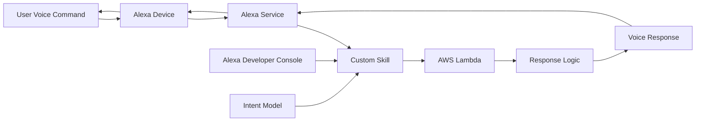

# Custom Alexa Skill - Portfolio Assistant

**Voice-Activated Portfolio Information System**

A production-ready Alexa skill that provides interactive voice responses about portfolio projects, demonstrating voice interface development, AWS Lambda integration, and conversational AI implementation.

## 🎯 Quick Overview for Recruiters

**Key Technical Highlights:**
- **Voice Interface:** Alexa Skills Kit (ASK) with custom intents
- **Backend:** Node.js Lambda function with voice response logic
- **Cloud Integration:** AWS Lambda, Alexa Developer Console
- **Conversational AI:** Natural language processing and response generation
- **Voice UX:** Professional voice interaction design
- **Deployment:** Serverless architecture with automatic scaling

**Live Demo:** "Alexa, ask Portfolio Assistant about my projects" | **Source Code:** [GitHub Repository](https://github.com/your-username/aws-portfolio)

---

## 🏗️ Architecture Overview



**Voice Interaction Flow:**
1. User speaks command to Alexa device
2. Alexa service processes speech-to-text
3. Custom skill receives structured intent
4. Lambda function processes request and generates response
5. Response converted to speech and delivered to user

---

## 💼 Technical Implementation

### Voice Interface Stack
- **Alexa Skills Kit (ASK)** - Voice interface framework
- **Intent Recognition** - Natural language understanding
- **Slot Types** - Parameter extraction from voice commands
- **Response Templates** - Structured voice responses
- **Session Management** - Multi-turn conversation handling

### Backend Stack
- **Node.js 18** - Lambda runtime environment
- **AWS Lambda** - Serverless compute for skill logic
- **JSON Response Format** - Alexa-compatible response structure
- **Error Handling** - Graceful fallback responses
- **Logging** - CloudWatch integration for debugging

### Development Tools
- **Alexa Developer Console** - Skill configuration and testing
- **ASK CLI** - Command-line development tools
- **Lambda Console** - Function deployment and monitoring
- **Voice Simulator** - Testing without physical device

---

## 📁 Project Structure

```
03-custom-alexa-skill/
├── lambda/                     # Lambda Function Code
│   ├── index.js               # Main skill handler
│   └── package.json           # Dependencies
├── skill-manifest.json        # Skill configuration
├── interaction-model.json     # Voice interface model
├── README.md                  # This documentation
└── deployment-guide.md        # Setup instructions
```

---

## 🎤 Voice Interface Design

### Skill Invocation
```
User: "Alexa, open Portfolio Assistant"
Alexa: "Hello! I can tell you about your AWS projects. What would you like to know?"
```

### Custom Intents

**GetProjectCountIntent:**
```
User: "How many projects do I have?"
Alexa: "You have completed 6 AWS projects so far. Keep going!"
```

**ProjectInfoIntent:**
```
User: "Tell me about my static website project"
Alexa: "Your static website project uses React, AWS S3, and CloudFront for global delivery..."
```

**HelpIntent:**
```
User: "Help"
Alexa: "You can ask me about your projects, project count, or specific technologies used."
```

### Intent Model Configuration
```json
{
  "intents": [
    {
      "name": "GetProjectCountIntent",
      "samples": [
        "how many projects do I have",
        "what's my project count",
        "tell me about my portfolio"
      ]
    },
    {
      "name": "ProjectInfoIntent",
      "slots": [
        {
          "name": "ProjectName",
          "type": "CUSTOM_PROJECT_TYPES"
        }
      ],
      "samples": [
        "tell me about {ProjectName}",
        "what is {ProjectName}",
        "describe {ProjectName} project"
      ]
    }
  ]
}
```

---

## 🚀 Core Functionality

### Lambda Handler Implementation
```javascript
exports.handler = async (event) => {
    console.log("Received event:", JSON.stringify(event));

    const intent = event.request?.intent?.name || "Unknown";
    let speechText = "Hello! This is your custom Alexa skill.";

    if (intent === "GetProjectCountIntent") {
        const projectCount = 6; // Dynamic count from database/API
        speechText = `You have completed ${projectCount} AWS projects so far. Keep going!`;
    }

    if (intent === "ProjectInfoIntent") {
        const projectName = event.request.intent.slots?.ProjectName?.value;
        speechText = getProjectDetails(projectName);
    }

    return {
        version: "1.0",
        response: {
            outputSpeech: {
                type: "PlainText",
                text: speechText,
            },
            shouldEndSession: true,
        },
    };
};
```

### Advanced Features
- **Dynamic Content** - Real-time project information
- **Error Handling** - Graceful responses for unrecognized intents
- **Session Management** - Multi-turn conversations
- **Personalization** - User-specific responses
- **Analytics** - Usage tracking and optimization

---

## 🔧 Setup & Configuration

### Alexa Developer Console Setup

**1. Create New Skill:**
```
Skill Name: Portfolio Assistant
Default Language: English (US)
Model: Custom
Backend: AWS Lambda
```

**2. Interaction Model:**
```json
{
  "languageModel": {
    "invocationName": "portfolio assistant",
    "intents": [
      {
        "name": "AMAZON.CancelIntent",
        "samples": []
      },
      {
        "name": "AMAZON.HelpIntent",
        "samples": []
      },
      {
        "name": "AMAZON.StopIntent",
        "samples": []
      },
      {
        "name": "GetProjectCountIntent",
        "samples": [
          "how many projects do I have",
          "what's my project count",
          "tell me my portfolio stats"
        ]
      }
    ]
  }
}
```

**3. Endpoint Configuration:**
```
Service Endpoint Type: AWS Lambda ARN
Default Region: arn:aws:lambda:us-east-1:123456789:function:portfolio-alexa-skill
```

### AWS Lambda Configuration

**Runtime Settings:**
```
Runtime: Node.js 18.x
Handler: index.handler
Memory: 128 MB
Timeout: 30 seconds
```

**Environment Variables:**
```
SKILL_ID=amzn1.ask.skill.your-skill-id
LOG_LEVEL=INFO
```

---

## 🛡️ Security & Permissions

### Lambda Execution Role
```json
{
    "Version": "2012-10-17",
    "Statement": [
        {
            "Effect": "Allow",
            "Action": [
                "logs:CreateLogGroup",
                "logs:CreateLogStream",
                "logs:PutLogEvents"
            ],
            "Resource": "arn:aws:logs:*:*:*"
        }
    ]
}
```

### Skill Permissions
- **No sensitive data access** - Read-only portfolio information
- **CloudWatch Logging** - Error tracking and debugging
- **Lambda Invocation** - Alexa service permissions

---

## 🚀 Local Development & Testing

### Prerequisites
- AWS CLI configured
- Alexa Developer Console account
- Node.js 18+ installed

### Development Workflow
```bash
# Test Lambda function locally
cd 03-custom-alexa-skill/lambda
node index.js

# Deploy to Lambda
zip -r skill-deployment.zip index.js package.json
aws lambda update-function-code \
  --function-name portfolio-alexa-skill \
  --zip-file fileb://skill-deployment.zip

# Test in Alexa Developer Console
# Use the Test tab to simulate voice interactions
```

### Testing Commands
```bash
# Test intent recognition
echo '{"request":{"intent":{"name":"GetProjectCountIntent"}}}' | \
  aws lambda invoke --function-name portfolio-alexa-skill response.json

# View logs
aws logs tail /aws/lambda/portfolio-alexa-skill --follow
```

---

## 📊 Analytics & Monitoring

### Alexa Analytics Dashboard
- **Unique Users** - Daily/monthly active users
- **Session Duration** - Average interaction time
- **Intent Usage** - Most popular voice commands
- **Error Rates** - Failed interactions and reasons

### CloudWatch Metrics
```javascript
// Custom metrics in Lambda
const AWS = require('aws-sdk');
const cloudwatch = new AWS.CloudWatch();

await cloudwatch.putMetricData({
    Namespace: 'AlexaSkill/Portfolio',
    MetricData: [{
        MetricName: 'IntentInvocations',
        Value: 1,
        Unit: 'Count',
        Dimensions: [{
            Name: 'IntentName',
            Value: intent
        }]
    }]
}).promise();
```

---

## 🎯 Voice UX Best Practices

### Conversation Design
- **Clear Prompts** - Guide users on available commands
- **Error Recovery** - Helpful responses for misunderstood requests
- **Brevity** - Concise but informative responses
- **Natural Language** - Conversational tone and phrasing

### Response Examples
```javascript
const responses = {
    welcome: "Welcome to Portfolio Assistant! You can ask about project count, specific projects, or technologies used.",
    
    projectCount: `You have ${count} impressive AWS projects showcasing cloud architecture, serverless computing, and modern web development.`,
    
    projectDetails: `Your ${projectName} project demonstrates ${technologies.join(', ')} with ${features.join(' and ')}.`,
    
    fallback: "I didn't catch that. You can ask about your projects, project count, or say help for more options."
};
```

---

## 🚀 Deployment Guide

### Step-by-Step Deployment

**1. Lambda Function Setup:**
```bash
# Create Lambda function
aws lambda create-function \
  --function-name portfolio-alexa-skill \
  --runtime nodejs18.x \
  --role arn:aws:iam::account:role/lambda-execution-role \
  --handler index.handler \
  --zip-file fileb://function.zip
```

**2. Alexa Skill Configuration:**
- Create skill in Alexa Developer Console
- Configure interaction model
- Set Lambda ARN as endpoint
- Test and certify skill

**3. Publishing Process:**
- Skill testing and validation
- Privacy policy and terms of service
- Skill store submission (optional)
- Distribution settings

---

## 📈 Future Enhancements

### Planned Features
- **Multi-language Support** - Spanish, French language models
- **Visual Cards** - Rich responses for Echo Show devices
- **Account Linking** - Personalized user experiences
- **External APIs** - Real-time project data integration
- **Voice Shopping** - Skill monetization options

### Advanced Capabilities
- **Progressive Response** - Handle long-running requests
- **Push Notifications** - Proactive skill updates
- **Multi-modal** - Screen and voice interactions
- **Personalization** - User preference learning

---

## 📚 Technical Resources

### Documentation
- [Alexa Skills Kit Documentation](https://developer.amazon.com/en-US/docs/alexa/ask-overviews/what-is-the-alexa-skills-kit.html)
- [AWS Lambda for Alexa Skills](https://developer.amazon.com/en-US/docs/alexa/custom-skills/host-a-custom-skill-as-an-aws-lambda-function.html)
- [Voice Design Guidelines](https://developer.amazon.com/en-US/docs/alexa/alexa-design/get-started.html)

### Best Practices
- [Alexa Skill Development Best Practices](https://developer.amazon.com/en-US/docs/alexa/alexa-skills-kit-sdk-for-nodejs/develop-your-first-skill.html)
- [Voice User Interface Design](https://developer.amazon.com/en-US/docs/alexa/alexa-design/design-process.html)

---

**Project Demonstrates:** Voice Interface Development, Conversational AI, AWS Lambda Integration, Natural Language Processing, Voice UX Design, and Serverless Architecture.