# 🎤 Build “Sassy GPT” – A Custom Alexa Voice Assistant

**Step-by-Step Guide with Actual Screenshots**

Create a fun, sassy AI-powered Alexa skill using the Alexa Developer Console and Google Gemini API.

---

## 📋 Prerequisites

* Amazon Developer Account – [Sign up](https://developer.amazon.com/)
* AWS Account – For Lambda function hosting (Alexa-hosted in this case)
* Google Gemini API Key – From [Google AI Studio](https://aistudio.google.com/)

---

## 🚀 Step 1: Start in Alexa Developer Console

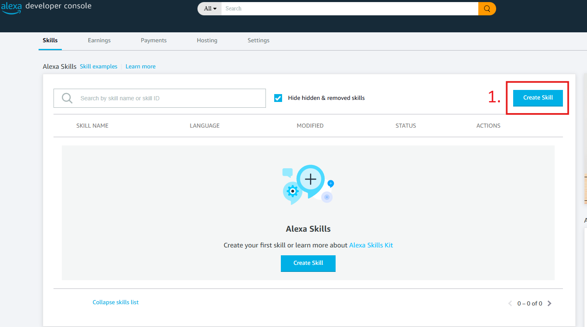

1. Go to [Alexa Developer Console](https://developer.amazon.com/alexa/console/ask)
2. Click **“Create Skill”**

---

## 📝 Step 2–6: Skill Setup

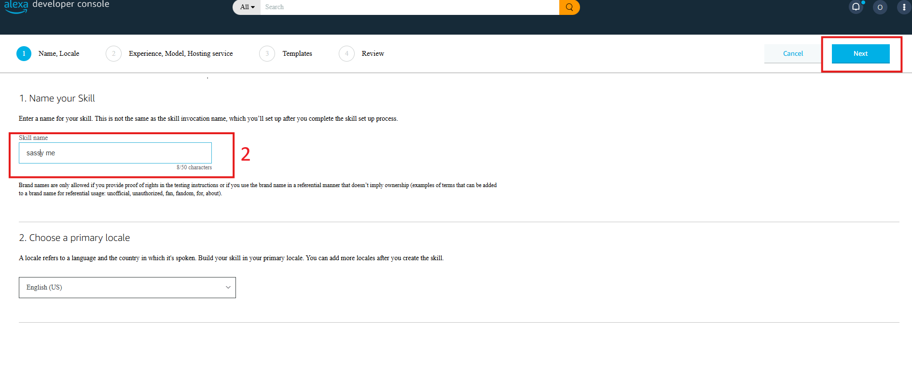
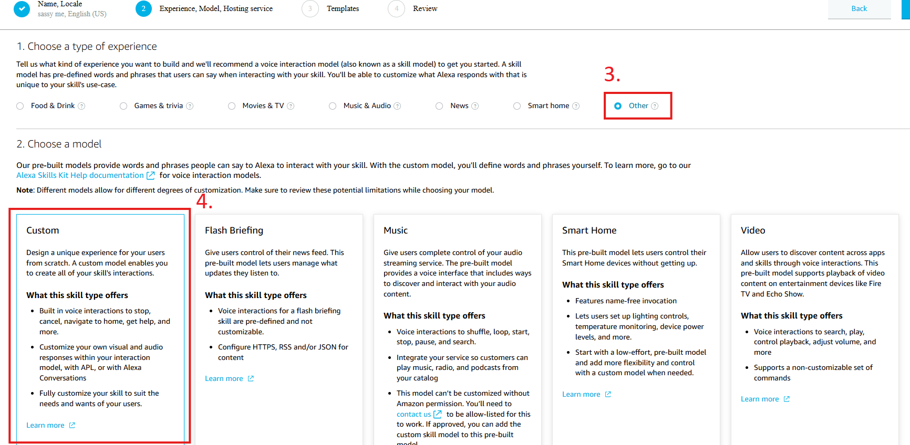
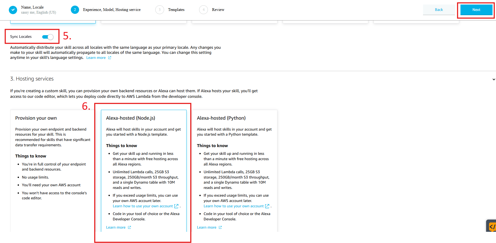
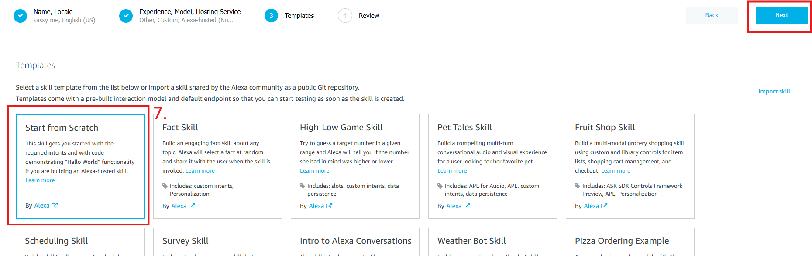
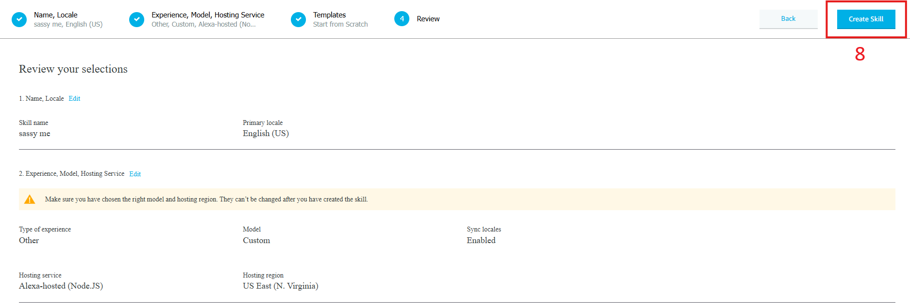

1. **Skill Name:** `sassy GPT`
2. **Primary Locale:** English (US)
3. **Model:** Custom
4. **Hosting:** Alexa-hosted (Node.js)
5. **Template:** Start from Scratch
6. Click **“Create Skill”**

---

## 🔄 Step 7: Let it Build

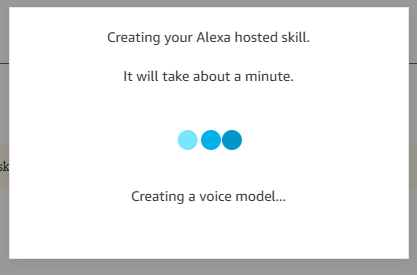

Wait for Alexa to finish setting up your skill environment.

---

## 📣 Step 8: Skill Invocation Name

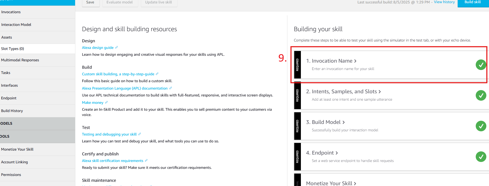

Set the **Invocation Name** to: `sassy me`

> What users will say: *“Alexa, open sassy me”*
> Click **Save** and **Build**.

---

## 🧠 Step 9–11: Intents + Slots

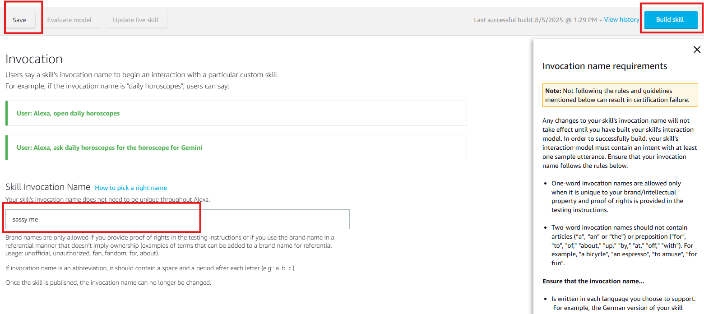
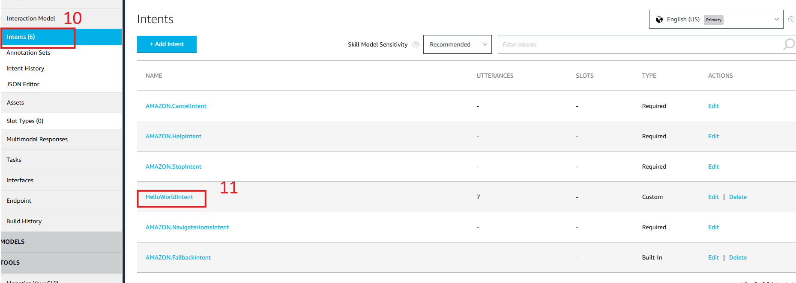
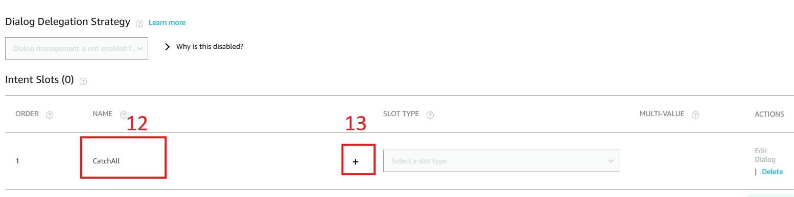
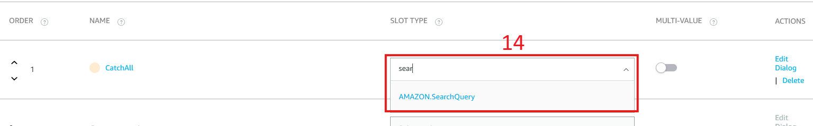
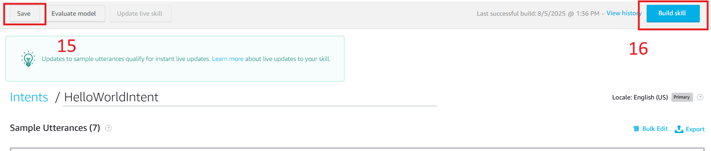

1. In `HelloWorldIntent`, click **+ Add Slot**
2. **Slot Name:** `CatchAll`
3. **Slot Type:** `AMAZON.SearchQuery`
4. Add utterance: `{CatchAll}`
5. Click **Save** and then **Build**

---

## 💪 Step 12: Add the Code

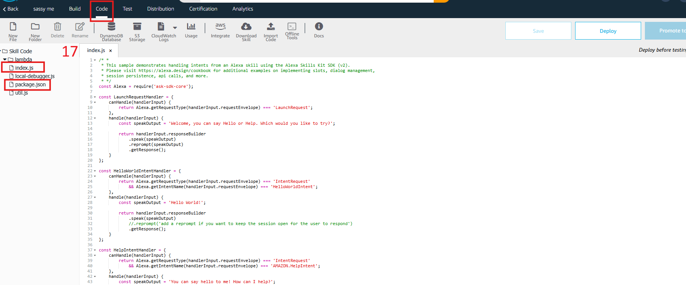
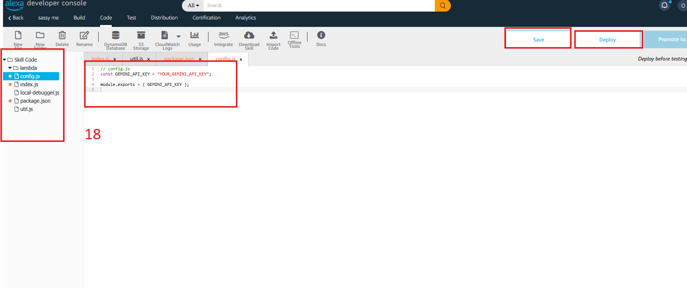

1. Go to **Code** tab
2. Replace existing code with files from `03-custom-alexa-skill/lambda`
3. Replace `GEMINI_API_KEY` with your real key
4. Click **Save** and then **Deploy**

---

## 🎤 Step 13: Voice Testing

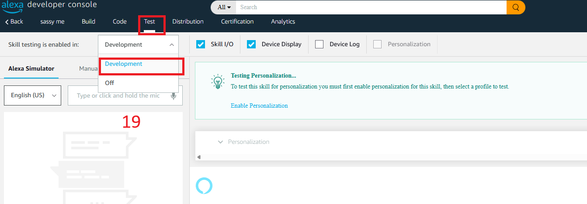

1. Open the **Test** tab
2. Enable testing (select **Development**)
3. Say or type: `Alexa, sassy me`
4. Then say: `hello` or anything fun!

Try:

* `how are you`
* `tell me a joke`
* `what's up`

---

## 🚀 Step 14: Launch & Use

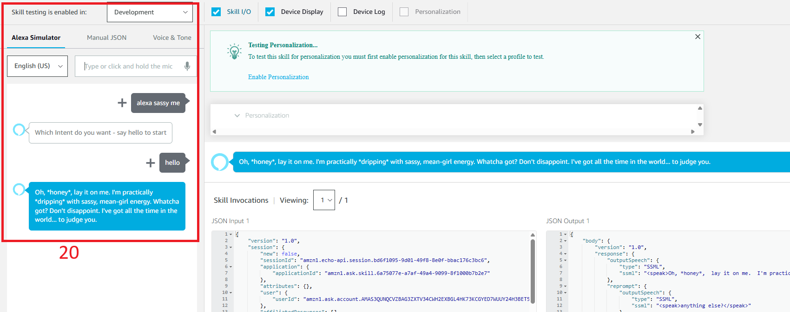

Your skill is now live (for development):

* Test on your Alexa device
* Submit for certification if you want to publish

---

## 🔧 Configuration Notes

### API Key

* Replace `your-gemini-api-key-here` in code

### Invocation Name

* Say: `Alexa, open sassy me`

### Intent Handlers

* `LaunchRequestHandler`
* `HelloWorldIntentHandler` ➔ Calls Gemini API
* CatchAll slot ➔ Captures any voice input

---

## 🧪 Testing Examples

1. `Alexa, sassy me`
2. `hello`
3. `how are you?`
4. `tell me something funny`

---

## ✅ Done! Your skill is now live with a sassy AI attitude.

* Gemini API gives dynamic answers
* Alexa captures full sentences via CatchAll
* Fully hosted, voice-tested, and developer ready

**🎉 Congrats! You've built your custom AI voice assistant.**
