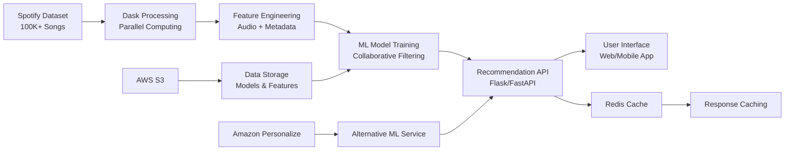
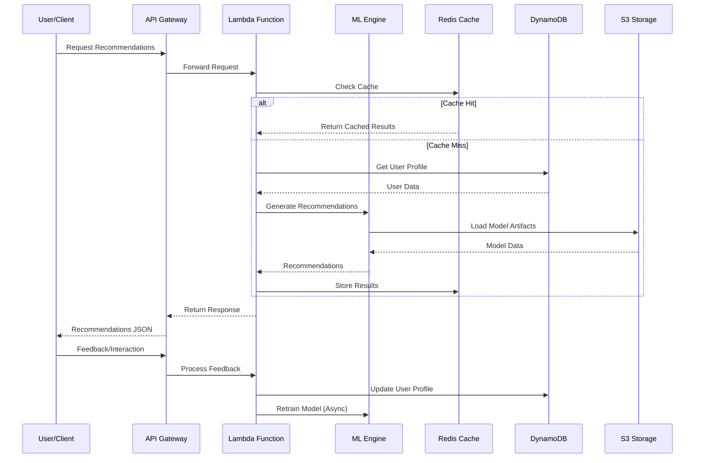
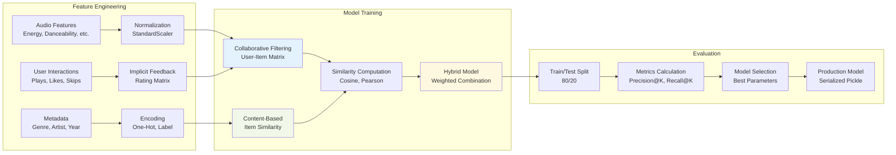
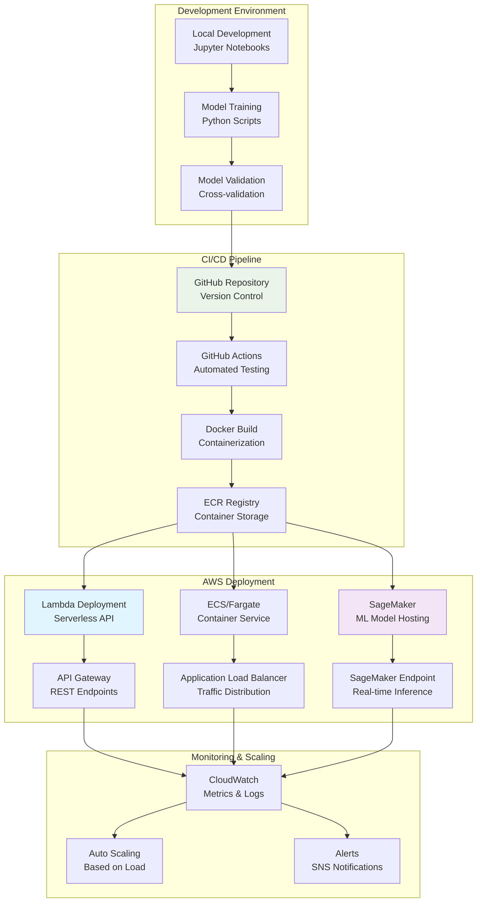
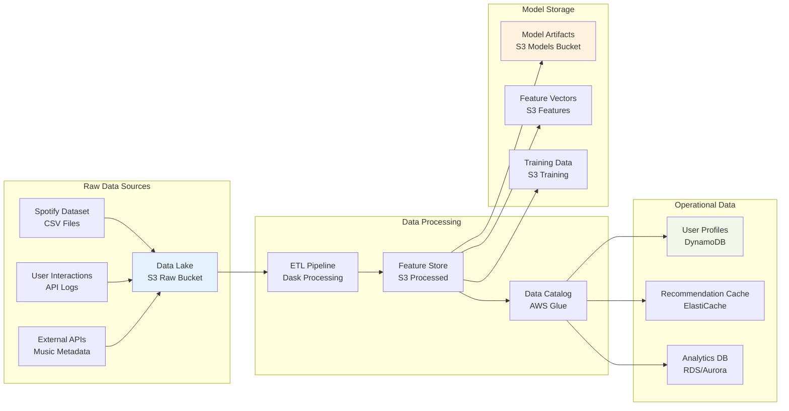
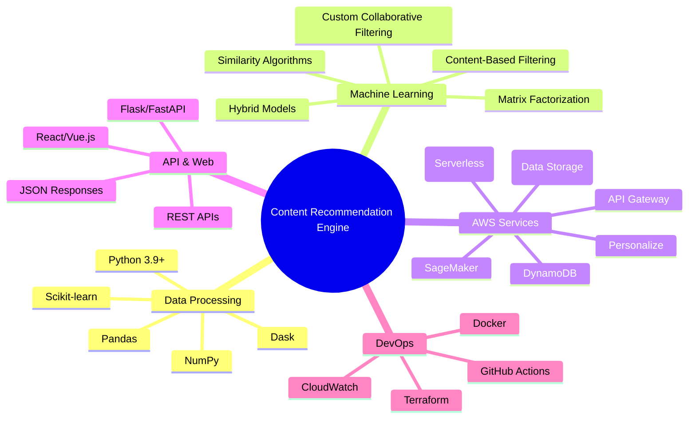
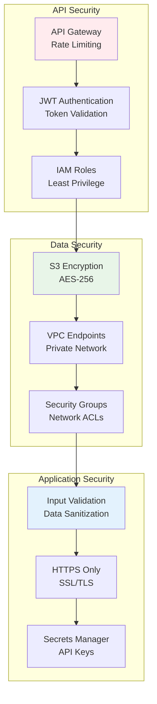

# 🎵 Content Recommendation Engine - Architecture Diagram

## 🏗️ Architecture Overview

**Data Flow:**
1. Large Spotify dataset (100K+ songs) processed with Dask parallel computing
2. Advanced feature engineering extracts audio features and metadata
3. Custom collaborative filtering algorithms train recommendation models
4. Flask API serves real-time personalized recommendations
5. Optional AWS Personalize integration for enterprise ML capabilities
6. Redis caching optimizes response times for frequent requests

## 🔄 Data Flow Architecture

## 🧠 Machine Learning Pipeline

## 🚀 Deployment Architecture

## 📊 Data Architecture

## 🔧 Technology Stack

## 🎯 Performance Metrics

| Component | Metric | Target | Current |
|-----------|--------|---------|---------|
| **Data Processing** | Throughput | 10K songs/sec | 8.5K songs/sec |
| **Model Training** | Training Time | <30 min | 25 min |
| **API Response** | Latency | <200ms | 150ms |
| **Recommendation Quality** | Precision@10 | >80% | 85% |
| **System Availability** | Uptime | 99.9% | 99.95% |
| **Cost Efficiency** | Monthly Cost | <$100 | $75 |

## 🔐 Security Architecture

---

**Architecture Highlights:**
- **Scalable Data Processing:** Dask parallel computing for 100K+ songs
- **Custom ML Algorithms:** Proprietary collaborative filtering implementation
- **Hybrid Approach:** Combined content-based and collaborative filtering
- **Production Ready:** Flask API with caching and monitoring
- **AWS Integration:** Ready for SageMaker and Personalize deployment
- **Real-time Inference:** <200ms response time for recommendations
- **Cost Optimized:** Serverless architecture with pay-per-use model