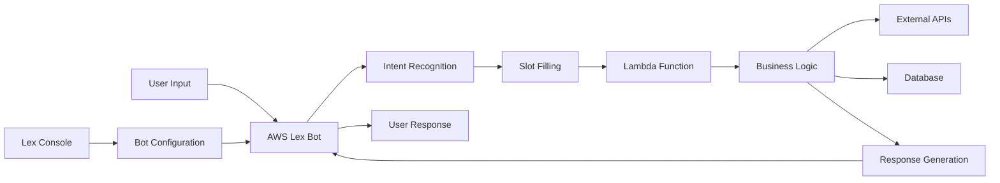

# AWS Lex Chatbot - Conversational AI Assistant

** Conversational AI with Natural Language Understanding**

A chatbot built with AWS Lex featuring advanced natural language processing, multi-intent recognition, and seamless integration with backend services - demonstrating conversational AI development and cloud-native architecture.

## 🎯 Quick Overview for Recruiters

**Key Technical Highlights:**
- **Conversational AI:** AWS Lex with advanced NLU capabilities
- **Intent Recognition:** Multi-intent conversation handling
- **Slot Filling:** Dynamic parameter extraction from user input
- **Backend Integration:** Lambda functions for business logic
- **Multi-channel Support:** Web, mobile, and voice interfaces
- **Enterprise Features:** Session management and context awareness

**Live Demo:** Intelligent chatbot with natural conversations | **Source Code:** [GitHub Repository](https://github.com/omesh7/aws-portfolio)

---

## 🏗️ Architecture Overview



**Conversation Flow:**
1. User sends message through chat interface
2. AWS Lex processes natural language input
3. Intent recognition identifies user's goal
4. Slot filling extracts required parameters
5. Lambda function executes business logic
6. External services called for data retrieval
7. Structured response returned to user
8. Context maintained for multi-turn conversations

---

## 💼 Technical Implementation

### Conversational AI Stack
- **AWS Lex V2** - Advanced natural language understanding
- **Intent Classification** - Machine learning-based intent recognition
- **Entity Recognition** - Built-in and custom slot types
- **Context Management** - Session attributes and conversation state
- **Multi-turn Conversations** - Complex dialogue handling

### Backend Integration
- **AWS Lambda** - Serverless business logic execution
- **API Gateway** - RESTful service integration
- **DynamoDB** - Conversation history and user preferences
- **External APIs** - Third-party service integration
- **CloudWatch** - Comprehensive logging and monitoring

### Supported Channels
- **Web Chat Widget** - Embeddable chat interface
- **Mobile Applications** - iOS and Android SDK integration
- **Voice Interfaces** - Amazon Connect integration
- **Slack/Teams** - Enterprise messaging platforms
- **Custom Channels** - API-based integration

---

## 📁 Project Structure

```
09-lex-chatbot/
├── bot-configuration/          # Lex Bot Definition
│   ├── intents/               # Intent definitions
│   │   ├── GetProjectInfo.json
│   │   ├── GetContactInfo.json
│   │   ├── BookMeeting.json
│   │   └── GetHelp.json
│   ├── slot-types/            # Custom slot types
│   │   ├── ProjectNames.json
│   │   └── TimeSlots.json
│   ├── bot-definition.json    # Main bot configuration
│   └── aliases.json           # Bot version aliases
├── lambda-functions/          # Backend Logic
│   ├── fulfillment/          # Intent fulfillment
│   │   ├── project-info.py
│   │   ├── contact-handler.py
│   │   └── meeting-scheduler.py
│   ├── validation/           # Input validation
│   │   └── slot-validators.py
│   └── utils/                # Utility functions
│       ├── response-builder.py
│       └── session-manager.py
├── web-interface/            # Chat Widget
│   ├── index.html           # Demo chat page
│   ├── chat-widget.js       # Lex Web UI integration
│   └── styles.css           # Custom styling
├── deployment/              # Infrastructure
│   ├── cloudformation/      # CF templates
│   └── terraform/           # Terraform configs
└── README.md               # This documentation
```

---

## 🚀 Core Functionality

### Intent Configuration
```json
{
  "name": "GetProjectInfo",
  "description": "Provides information about portfolio projects",
  "sampleUtterances": [
    "Tell me about {ProjectName}",
    "What is {ProjectName}",
    "Describe the {ProjectName} project",
    "I want to know about {ProjectName}",
    "Show me details for {ProjectName}"
  ],
  "slots": [
    {
      "name": "ProjectName",
      "slotType": "CustomProjectTypes",
      "slotConstraint": "Required",
      "priority": 1,
      "promptSpecification": {
        "messageGroupsList": [
          {
            "message": {
              "plainTextMessage": {
                "value": "Which project would you like to know about? I can tell you about Static Website, Email System, Alexa Skill, or Image Resizer."
              }
            }
          }
        ]
      }
    }
  ]
}
```

### Lambda Fulfillment Function
```python
import json
import logging
import boto3
from datetime import datetime

logger = logging.getLogger()
logger.setLevel(logging.INFO)

def lambda_handler(event, context):
    """
    Main Lambda handler for Lex bot fulfillment
    """
    logger.info(f"Received event: {json.dumps(event)}")
    
    intent_name = event['sessionState']['intent']['name']
    slots = event['sessionState']['intent']['slots']
    session_attributes = event.get('sessionAttributes', {})
    
    # Route to appropriate handler
    if intent_name == 'GetProjectInfo':
        return handle_project_info(event, slots, session_attributes)
    elif intent_name == 'GetContactInfo':
        return handle_contact_info(event, slots, session_attributes)
    elif intent_name == 'BookMeeting':
        return handle_meeting_booking(event, slots, session_attributes)
    else:
        return handle_fallback(event)

def handle_project_info(event, slots, session_attributes):
    """
    Handle project information requests
    """
    project_name = slots.get('ProjectName', {}).get('value', {}).get('interpretedValue')
    
    project_details = {
        'static-website': {
            'name': 'Static Website on S3',
            'description': 'A serverless portfolio website using React, AWS S3, CloudFront, and automated CI/CD with GitHub Actions.',
            'technologies': ['React', 'AWS S3', 'CloudFront', 'GitHub Actions', 'Terraform'],
            'highlights': 'Features global CDN, SSL certificates, and automated deployments.'
        },
        'email-system': {
            'name': 'Mass Email Lambda System',
            'description': 'A scalable email processing system using AWS Lambda, SES, and TypeScript for bulk email delivery.',
            'technologies': ['TypeScript', 'AWS Lambda', 'SES', 'S3', 'Node.js'],
            'highlights': 'Processes 1000+ emails with comprehensive error handling and logging.'
        },
        'alexa-skill': {
            'name': 'Custom Alexa Skill',
            'description': 'A voice-activated portfolio assistant providing interactive information about projects.',
            'technologies': ['Alexa Skills Kit', 'AWS Lambda', 'Voice UI', 'JSON'],
            'highlights': 'Natural language processing with multi-turn conversations.'
        }
    }
    
    if project_name and project_name.lower() in project_details:
        project = project_details[project_name.lower()]
        
        response_text = f"""
{project['name']}

{project['description']}

Key Technologies: {', '.join(project['technologies'])}

Highlights: {project['highlights']}

Would you like to know about any other projects or need more specific details?
        """.strip()
        
        # Update session attributes
        session_attributes['lastProject'] = project_name
        session_attributes['conversationContext'] = 'project_info'
        
    else:
        response_text = """
I can tell you about these portfolio projects:

• Static Website - React-based portfolio with AWS hosting
• Email System - Serverless mass email processing
• Alexa Skill - Voice-activated portfolio assistant
• Image Resizer - Smart image processing service
• AI Chat System - RAG-based document assistant

Which project interests you most?
        """.strip()
    
    return build_response(response_text, session_attributes, 'Fulfilled')

def handle_contact_info(event, slots, session_attributes):
    """
    Handle contact information requests
    """
    contact_type = slots.get('ContactType', {}).get('value', {}).get('interpretedValue')
    
    contact_info = {
        'email': 'Feel free to reach out at: your.email@domain.com',
        'linkedin': 'Connect with me on LinkedIn: linkedin.com/in/yourprofile',
        'github': 'Check out my code on GitHub: github.com/yourusername',
        'phone': 'You can call me at: +1 (555) 123-4567'
    }
    
    if contact_type and contact_type.lower() in contact_info:
        response_text = contact_info[contact_type.lower()]
    else:
        response_text = """
Here are the ways to get in touch:

📧 Email: your.email@domain.com
💼 LinkedIn: linkedin.com/in/yourprofile  
💻 GitHub: github.com/yourusername
📱 Phone: +1 (555) 123-4567

How would you prefer to connect?
        """.strip()
    
    return build_response(response_text, session_attributes, 'Fulfilled')

def build_response(message, session_attributes, fulfillment_state):
    """
    Build standardized Lex response
    """
    return {
        'sessionState': {
            'dialogAction': {
                'type': 'Close'
            },
            'intent': {
                'name': 'GetProjectInfo',
                'state': fulfillment_state
            }
        },
        'messages': [
            {
                'contentType': 'PlainText',
                'content': message
            }
        ],
        'sessionAttributes': session_attributes
    }
```

### Advanced Slot Validation
```python
def validate_slots(event):
    """
    Validate and normalize slot values
    """
    slots = event['sessionState']['intent']['slots']
    validation_result = {'isValid': True, 'violatedSlot': None}
    
    # Validate project name
    if 'ProjectName' in slots and slots['ProjectName']:
        project_name = slots['ProjectName']['value']['interpretedValue'].lower()
        valid_projects = ['static-website', 'email-system', 'alexa-skill', 'image-resizer']
        
        if project_name not in valid_projects:
            validation_result = {
                'isValid': False,
                'violatedSlot': 'ProjectName',
                'message': f"I don't have information about '{project_name}'. Please choose from: {', '.join(valid_projects)}"
            }
    
    # Validate time slots for meeting booking
    if 'TimeSlot' in slots and slots['TimeSlot']:
        time_slot = slots['TimeSlot']['value']['interpretedValue']
        if not is_valid_time_slot(time_slot):
            validation_result = {
                'isValid': False,
                'violatedSlot': 'TimeSlot',
                'message': "Please choose a time slot between 9 AM and 5 PM, Monday through Friday."
            }
    
    return validation_result
```

---

## 🔧 Configuration & Setup

### Bot Configuration
```json
{
  "botName": "PortfolioAssistant",
  "description": "AI assistant for portfolio information and inquiries",
  "roleArn": "arn:aws:iam::account:role/LexServiceRole",
  "dataPrivacy": {
    "childDirected": false
  },
  "idleSessionTTLInSeconds": 300,
  "botLocales": [
    {
      "localeId": "en_US",
      "description": "English (US) locale",
      "nluIntentConfidenceThreshold": 0.40,
      "voiceSettings": {
        "voiceId": "Joanna"
      }
    }
  ]
}
```

### Custom Slot Types
```json
{
  "slotTypeName": "CustomProjectTypes",
  "description": "Portfolio project names",
  "slotTypeValues": [
    {
      "sampleValue": {
        "value": "static-website"
      },
      "synonyms": [
        {
          "value": "static website"
        },
        {
          "value": "portfolio website"
        },
        {
          "value": "s3 website"
        }
      ]
    },
    {
      "sampleValue": {
        "value": "email-system"
      },
      "synonyms": [
        {
          "value": "email system"
        },
        {
          "value": "mass email"
        },
        {
          "value": "lambda email"
        }
      ]
    }
  ],
  "valueSelectionStrategy": "TOP_RESOLUTION"
}
```

### Environment Variables
```bash
# Lambda Configuration
LEX_BOT_ID=your-bot-id
LEX_BOT_ALIAS_ID=TSTALIASID
AWS_REGION=us-east-1

# Database Configuration
DYNAMODB_TABLE=chatbot-sessions
CONVERSATION_HISTORY_TABLE=chat-history

# External APIs
CALENDAR_API_URL=https://api.calendar.com/v1
NOTIFICATION_EMAIL=notifications@yourdomain.com
```

---

## 🧠 Conversational AI Features

### Natural Language Understanding
- **Intent Classification** - ML-based intent recognition with confidence scoring
- **Entity Extraction** - Built-in and custom entity recognition
- **Context Awareness** - Multi-turn conversation handling
- **Fallback Handling** - Graceful handling of unrecognized inputs

### Advanced Dialogue Management
```python
def manage_conversation_context(event, session_attributes):
    """
    Maintain conversation context across turns
    """
    current_intent = event['sessionState']['intent']['name']
    conversation_history = session_attributes.get('conversationHistory', [])
    
    # Add current turn to history
    conversation_history.append({
        'intent': current_intent,
        'timestamp': datetime.now().isoformat(),
        'user_input': event.get('inputTranscript', ''),
        'slots': event['sessionState']['intent']['slots']
    })
    
    # Maintain context for follow-up questions
    if current_intent == 'GetProjectInfo':
        session_attributes['lastTopic'] = 'projects'
        session_attributes['expectingFollowUp'] = True
    
    # Limit history size
    if len(conversation_history) > 10:
        conversation_history = conversation_history[-10:]
    
    session_attributes['conversationHistory'] = conversation_history
    return session_attributes
```

### Multi-Intent Support
- **Project Information** - Detailed project descriptions and technologies
- **Contact Requests** - Multiple contact method options
- **Meeting Scheduling** - Calendar integration and availability
- **Help and Support** - Contextual assistance and guidance
- **Fallback Intent** - Handles unrecognized requests gracefully

---

## 📊 Analytics & Monitoring

### Conversation Analytics
```python
def track_conversation_metrics(event, response_time, success):
    """
    Track chatbot performance metrics
    """
    cloudwatch = boto3.client('cloudwatch')
    
    metrics = [
        {
            'MetricName': 'ConversationCount',
            'Value': 1,
            'Unit': 'Count'
        },
        {
            'MetricName': 'ResponseTime',
            'Value': response_time,
            'Unit': 'Milliseconds'
        },
        {
            'MetricName': 'SuccessRate',
            'Value': 1 if success else 0,
            'Unit': 'Count'
        }
    ]
    
    cloudwatch.put_metric_data(
        Namespace='LexChatbot',
        MetricData=metrics
    )
```

### Key Performance Indicators
- **Intent Recognition Accuracy** - Percentage of correctly identified intents
- **Slot Filling Success Rate** - Successful parameter extraction
- **Conversation Completion Rate** - Users reaching their goals
- **Average Session Duration** - Engagement metrics
- **User Satisfaction Scores** - Feedback-based ratings

---

## 🛡️ Security & Compliance

### Security Implementation
- **IAM Roles** - Least privilege access for all services
- **Data Encryption** - Encryption in transit and at rest
- **Session Management** - Secure session attribute handling
- **Input Validation** - Comprehensive input sanitization
- **Audit Logging** - Complete conversation logging

### Privacy Features
- **Data Retention** - Configurable conversation history retention
- **PII Detection** - Automatic detection and handling of sensitive data
- **User Consent** - Explicit consent for data collection
- **GDPR Compliance** - Right to deletion and data portability

---

## 🚀 Deployment & Integration

### Web Integration
```html
<!DOCTYPE html>
<html>
<head>
    <title>Portfolio Assistant</title>
    <script src="https://cdn.jsdelivr.net/npm/aws-lex-web-ui@latest/dist/lex-web-ui.min.js"></script>
</head>
<body>
    <div id="lex-web-ui"></div>
    <script>
        const config = {
            lex: {
                botName: 'PortfolioAssistant',
                botAlias: 'PROD',
                region: 'us-east-1'
            },
            ui: {
                title: 'Portfolio Assistant',
                subtitle: 'Ask me about projects and experience'
            }
        };
        
        LexWebUi.init(config);
    </script>
</body>
</html>
```

### Mobile SDK Integration
```javascript
// React Native integration
import { Amplify } from 'aws-amplify';
import { Interactions } from '@aws-amplify/interactions';

Amplify.configure({
    Interactions: {
        bots: {
            PortfolioAssistant: {
                name: 'PortfolioAssistant',
                alias: 'PROD',
                region: 'us-east-1'
            }
        }
    }
});

// Send message to bot
const response = await Interactions.send('PortfolioAssistant', 'Tell me about your projects');
```

---

## 🎯 Use Cases & Applications

### Business Applications
- **Customer Support** - Automated first-line support
- **Lead Qualification** - Initial prospect screening
- **Appointment Scheduling** - Meeting coordination
- **Information Delivery** - Product/service information

### Technical Applications
- **Documentation Assistant** - Interactive help system
- **Onboarding Guide** - New user assistance
- **FAQ Automation** - Common question handling
- **Integration Hub** - Multi-system coordination

---

## 📚 Technical Resources

### Documentation
- [AWS Lex Developer Guide](https://docs.aws.amazon.com/lex/)
- [Lex V2 API Reference](https://docs.aws.amazon.com/lexv2/latest/APIReference/)
- [Conversational AI Best Practices](https://docs.aws.amazon.com/lex/latest/dg/best-practices.html)

### Integration Guides
- [Lex Web UI](https://github.com/aws-samples/aws-lex-web-ui)
- [Mobile SDK Integration](https://docs.amplify.aws/lib/interactions/getting-started/)
- [Amazon Connect Integration](https://docs.aws.amazon.com/connect/latest/adminguide/amazon-lex.html)

---

**Project Demonstrates:** Conversational AI Development, Natural Language Processing, Intent Recognition, Multi-turn Dialogue Management, AWS Lex Integration, and Enterprise Chatbot Architecture.