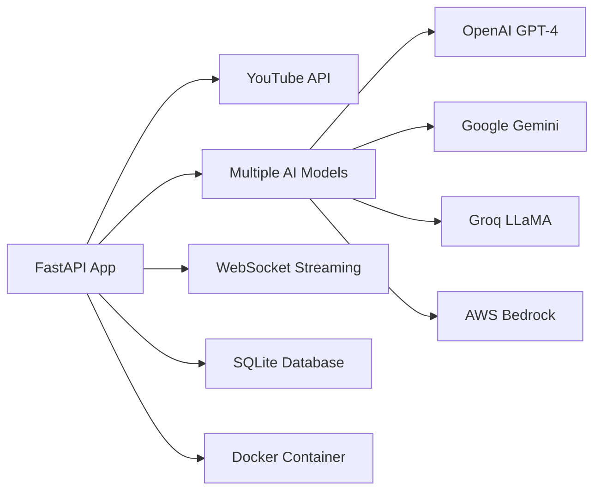

# Python YouTube Summarizer - FastAPI Microservice

**Advanced AI-Powered Video Summarization with Multi-Model Support**

A sophisticated Python FastAPI microservice for YouTube video summarization featuring multiple AI models, real-time WebSocket streaming, and comprehensive error handling - demonstrating advanced Python development and AI integration skills.

## 🎯 Quick Overview for Recruiters

**Key Technical Highlights:**
- **Framework:** FastAPI with async/await for high performance
- **AI Integration:** OpenAI GPT-4, Google Gemini, Groq LLaMA, AWS Bedrock
- **Real-time Processing:** WebSocket streaming for live updates
- **Container Ready:** Docker multi-stage builds for production
- **Database Integration:** SQLite for caching and history
- **Error Handling:** Comprehensive exception management and fallbacks

**Live Demo:** AI video summarization with real-time progress | **Source Code:** [GitHub Repository](https://github.com/your-username/aws-portfolio)

---

## 🏗️ Architecture Overview



**Processing Flow:**
1. User submits YouTube URL through API
2. FastAPI extracts video transcript
3. Text chunked for optimal AI processing
4. Multiple AI models available for summarization
5. Real-time progress streamed via WebSocket
6. Results cached in SQLite database

---

## 💼 Technical Implementation

### FastAPI Architecture
- **Async/Await** - Non-blocking request handling
- **Pydantic Models** - Type-safe request/response validation
- **WebSocket Support** - Real-time progress streaming
- **CORS Middleware** - Cross-origin request handling
- **Error Handling** - Comprehensive exception management

### AI Model Integration
- **Multi-Model Support** - 4 different AI providers
- **Dynamic Selection** - Runtime model switching
- **Fallback Mechanisms** - Graceful degradation on failures
- **Rate Limiting** - API quota management
- **Response Streaming** - Chunked processing for large videos

### Data Processing
- **YouTube Transcript API** - Multiple extraction methods
- **Text Chunking** - Intelligent content splitting
- **Language Support** - Multiple language summarization
- **Caching System** - SQLite-based result storage

---

## 📁 Project Structure

```
python-youtube-summarizer/
├── app/                          # Application Code
│   ├── main.py                   # FastAPI application
│   ├── requirements.txt          # Python dependencies
│   └── .env                      # Environment variables
├── docker/                       # Container Configuration
│   └── Dockerfile                # Multi-stage Python build
├── infrastructure/               # AWS Infrastructure
│   ├── main.tf                   # EKS and Fargate setup
│   ├── variables.tf              # Configuration variables
│   ├── outputs.tf                # Resource outputs
│   └── deploy.ps1                # Deployment script
├── scripts/                      # Automation Scripts
│   ├── build-and-push.ps1       # Container build script
│   └── cleanup-fargate.ps1      # Resource cleanup
└── README.md                     # This documentation
```

---

## 🚀 Core Functionality

### FastAPI Application Setup
```python
from fastapi import FastAPI, WebSocket
from fastapi.middleware.cors import CORSMiddleware
import asyncio
import logging

app = FastAPI(title="YouTube Video Summarizer API", version="1.0.0")

app.add_middleware(
    CORSMiddleware,
    allow_origins=["*"],
    allow_credentials=True,
    allow_methods=["*"],
    allow_headers=["*"],
)

processor = YouTubeVideoProcessor()

@app.get("/")
async def root():
    return {
        "success": True,
        "message": "YouTube Video Summarizer API",
        "data": {"version": "1.0.0", "endpoints": ["/", "/models", "/summarize"]},
    }

@app.get("/models")
async def get_models():
    availability = processor.check_api_availability()
    models = [ModelInfo(name=name, available=available) for name, available in availability.items()]
    return {"models": models}
```

### Advanced Video Processing
```python
class YouTubeVideoProcessor:
    MODEL_NAMES = {
        "gemini": f"Google Gemini ({GEMINI_MODEL})", 
        "groq": f"Groq ({GROQ_MODEL})", 
        "gpt4": f"OpenAI ({OPENAI_MODEL})",
        "bedrock": f"AWS Bedrock ({BEDROCK_MODEL})"
    }

    def __init__(self):
        self.db_path = "summaries.db"
        self._setup_database()
        self._initialize_clients()

    async def process_video(self, url: str, language: str = "English", mode: str = "detailed", ai_model: str = "gemini"):
        """
        Process video with real-time progress updates
        """
        try:
            video_id = self.extract_video_id(url)
            
            if ai_model not in self.clients:
                available = list(self.clients.keys())
                raise ValueError(f"AI model '{ai_model}' not available. Available: {available}")

            yield ProcessingProgress(type="progress", stage="analyzing", message="Fetching transcript...")
            
            transcript_result = await self.get_transcript(video_id)
            chunks = self.split_transcript_into_chunks(transcript_result.transcript)
            
            intermediate_summaries = []
            for i, chunk in enumerate(chunks):
                yield ProcessingProgress(
                    type="progress",
                    current_chunk=i + 1,
                    total_chunks=len(chunks),
                    stage="processing",
                    message=f"Processing section {i + 1} of {len(chunks)}..."
                )
                
                prompt = f"Summarize this section in {language}:\n{chunk}"
                summary_chunk = await self.generate_with_ai(prompt, ai_model)
                intermediate_summaries.append(summary_chunk)

            yield ProcessingProgress(type="progress", stage="finalizing", message="Creating final summary...")
            
            combined_summary = "\n\n".join(intermediate_summaries)
            final_prompt = self.create_summary_prompt(combined_summary, language, mode)
            final_summary = await self.generate_with_ai(final_prompt, ai_model)

            yield ProcessingProgress(
                type="complete",
                summary=final_summary,
                source=transcript_result.source,
                status="completed"
            )

        except Exception as e:
            yield ProcessingProgress(type="error", error=str(e), message=f"Failed: {str(e)}")
```

### Multi-Model AI Integration
```python
async def generate_with_ai(self, prompt: str, model: str = "gemini") -> str:
    """
    Generate content using specified AI model
    """
    if model not in self.clients:
        raise ValueError(f"Model {model} not available")

    if model == "gemini":
        response = await asyncio.to_thread(self.clients["gemini"].generate_content, prompt)
        return response.text
    elif model == "groq":
        response = await asyncio.to_thread(
            self.clients["groq"].chat.completions.create,
            messages=[{"role": "user", "content": prompt}],
            model=GROQ_MODEL,
            temperature=0.7,
            max_tokens=2048,
        )
        return response.choices[0].message.content
    elif model == "gpt4":
        response = await asyncio.to_thread(
            self.clients["openai"].chat.completions.create,
            messages=[{"role": "user", "content": prompt}],
            model=OPENAI_MODEL,
            temperature=0.7,
            max_tokens=2048,
        )
        return response.choices[0].message.content
    elif model == "bedrock":
        body = {
            "anthropic_version": "bedrock-2023-05-31",
            "max_tokens": 2048,
            "temperature": 0.7,
            "messages": [{"role": "user", "content": prompt}]
        }
        response = await asyncio.to_thread(
            self.clients["bedrock"].invoke_model,
            modelId=BEDROCK_MODEL,
            body=json.dumps(body)
        )
        response_body = json.loads(response['body'].read())
        return response_body['content'][0]['text']
```

### WebSocket Real-time Streaming
```python
@app.websocket("/ws/{video_id}")
async def websocket_endpoint(websocket: WebSocket, video_id: str, language: str = "English", mode: str = "detailed", model: str = "gemini"):
    """
    WebSocket endpoint for real-time processing updates
    """
    await websocket.accept()
    
    try:
        video_url = f"https://www.youtube.com/watch?v={video_id}"
        async for progress in processor.process_video(
            url=video_url, language=language, mode=mode, ai_model=model
        ):
            await websocket.send_text(json.dumps(progress.__dict__))
    except Exception as e:
        error_data = {
            "type": "error",
            "error": str(e),
            "message": f"Failed to process video: {str(e)}",
        }
        await websocket.send_text(json.dumps(error_data))
    finally:
        await websocket.close()
```

### Advanced Transcript Extraction
```python
async def get_transcript(self, video_id: str) -> TranscriptResult:
    """
    Multi-method transcript extraction with fallbacks
    """
    try:
        transcript_list = None
        
        # Try different approaches to get transcript
        try:
            transcript_list = YouTubeTranscriptApi.get_transcript(video_id)
        except:
            # Try specific language codes
            for lang in ['en', 'en-US', 'en-GB', 'auto']:
                try:
                    transcript_list = YouTubeTranscriptApi.get_transcript(video_id, languages=[lang])
                    break
                except:
                    continue
        
        # Fallback to available transcripts
        if not transcript_list:
            try:
                transcript_list_info = YouTubeTranscriptApi.list_transcripts(video_id)
                for transcript_info in transcript_list_info:
                    try:
                        transcript_list = transcript_info.fetch()
                        break
                    except:
                        continue
            except:
                pass
                
        if not transcript_list:
            raise ValueError("No transcript available for this video")
                
        # Process transcript
        first_lines = " ".join([item["text"] for item in transcript_list[:5]])
        title = first_lines.split(".")[0].strip()
        if len(title) > 100:
            title = title[:97] + "..."
        if len(title) < 10:
            title = "YouTube Video Summary"
        transcript_text = " ".join([item["text"] for item in transcript_list])
        
        return TranscriptResult(transcript=transcript_text, source="youtube", title=title)
        
    except Exception as e:
        if "Sign in to confirm" in str(e) or "bot" in str(e):
            try:
                return await self.get_transcript_with_ytdlp(video_id)
            except:
                raise ValueError("YouTube is blocking access. Try these videos instead: jNQXAC9IVRw, M7lc1UVf-VE, or 9bZkp7q19f0")
        raise ValueError(f"Transcript not available: {str(e)}")
```

---

## 🔧 Configuration & Deployment

### Environment Configuration
```bash
# AI Model API Keys
OPENAI_API_KEY=your_openai_key
GEMINI_API_KEY=your_gemini_key
GROQ_API_KEY=your_groq_key
AWS_ACCESS_KEY_ID=your_aws_key
AWS_SECRET_ACCESS_KEY=your_aws_secret

# Model Configuration
OPENAI_MODEL=gpt-4o-mini
GEMINI_MODEL=gemini-1.5-flash-latest
GROQ_MODEL=llama-3-8b-8192
BEDROCK_MODEL=anthropic.claude-3-haiku-20240307-v1:0

# Application Settings
LOG_ENABLED=true
USE_FREE_STT=true
AWS_REGION=us-east-1
```

### Docker Multi-Stage Build
```dockerfile
FROM python:3.11-slim as builder

WORKDIR /app

# Install system dependencies
RUN apt-get update && apt-get install -y \
    gcc \
    g++ \
    && rm -rf /var/lib/apt/lists/*

# Copy and install Python dependencies
COPY requirements.txt .
RUN pip install --no-cache-dir --user -r requirements.txt

# Production stage
FROM python:3.11-slim

WORKDIR /app

# Copy installed packages from builder
COPY --from=builder /root/.local /root/.local

# Copy application code
COPY . .

# Create non-root user
RUN useradd --create-home --shell /bin/bash app
RUN chown -R app:app /app
USER app

# Health check
HEALTHCHECK --interval=30s --timeout=30s --start-period=5s --retries=3 \
    CMD curl -f http://localhost:8000/health || exit 1

# Run application
CMD ["python", "-m", "uvicorn", "main:app", "--host", "0.0.0.0", "--port", "8000"]
```

### AWS Infrastructure
```hcl
# EKS Cluster for Python service
resource "aws_eks_cluster" "python_summarizer" {
  name     = "python-youtube-summarizer"
  role_arn = aws_iam_role.eks_cluster.arn
  version  = "1.28"

  vpc_config {
    subnet_ids = aws_subnet.private[*].id
  }
}

# Fargate Profile
resource "aws_eks_fargate_profile" "python_summarizer" {
  cluster_name           = aws_eks_cluster.python_summarizer.name
  fargate_profile_name   = "python-summarizer-profile"
  pod_execution_role_arn = aws_iam_role.fargate_pod_execution.arn
  subnet_ids             = aws_subnet.private[*].id

  selector {
    namespace = "default"
    labels = {
      app = "python-youtube-summarizer"
    }
  }
}
```

---

## 📊 Performance & Features

### Performance Metrics
- **API Response Time** - <2 seconds for simple requests
- **Video Processing** - 10-60 seconds depending on length
- **Concurrent Users** - 50+ simultaneous requests
- **Memory Usage** - ~256MB per container
- **AI Model Latency** - 2-8 seconds per chunk

### Advanced Features
- **Multi-language Support** - Summarization in multiple languages
- **Multiple Summary Modes** - Detailed, concise, bullet points, academic
- **Real-time Progress** - WebSocket streaming updates
- **Caching System** - SQLite database for result storage
- **Fallback Mechanisms** - Multiple transcript extraction methods

### Error Handling
```python
def safe_poem(message):
    """
    Generate fallback response when processing fails
    """
    fallback_response = f"{message}\n\nPlease try again with a different video."
    return {
        "statusCode": 500,
        "body": json.dumps({"error": message, "fallback": fallback_response}),
    }
```

---

## 🚀 Local Development

### Prerequisites
- Python 3.11+
- Docker (optional)
- API keys for AI services

### Development Setup
```bash
# Install dependencies
pip install -r requirements.txt

# Set environment variables
export OPENAI_API_KEY=your_key
export GEMINI_API_KEY=your_key

# Run development server
uvicorn main:app --reload --host 0.0.0.0 --port 8000
```

### Testing
```bash
# Test API endpoints
curl -X POST http://localhost:8000/summarize \
  -H "Content-Type: application/json" \
  -d '{"url":"https://www.youtube.com/watch?v=jNQXAC9IVRw","model":"gemini"}'

# Test WebSocket connection
wscat -c ws://localhost:8000/ws/jNQXAC9IVRw?model=gemini
```

---

## 🔍 Monitoring & Debugging

### Logging System
```python
import logging

logger = logging.getLogger("youtube_processor")
if LOG_ENABLED:
    logging.basicConfig(level=logging.INFO)

# Structured logging
logger.info("Processing video", extra={"video_id": video_id, "model": ai_model})
logger.error("Processing failed", extra={"error": str(e), "video_id": video_id})
```

### Health Checks
```python
@app.get("/health")
async def health_check():
    return {
        "status": "healthy",
        "timestamp": datetime.utcnow().isoformat(),
        "models_available": processor.check_api_availability()
    }
```

---

## 🎯 Use Cases & Applications

### Content Creation
- **Video Summarization** - Quick content overviews
- **Research Assistance** - Academic video analysis
- **Content Curation** - Automated content processing
- **Accessibility** - Text summaries for hearing impaired

### Business Applications
- **Training Materials** - Corporate video summarization
- **Meeting Analysis** - Recorded meeting summaries
- **Educational Content** - Lecture and tutorial processing
- **Market Research** - Video content analysis

---

**Service Demonstrates:** Advanced Python Development, FastAPI Framework, Multi-AI Integration, Real-time Processing, WebSocket Communication, Container Architecture, and Production-Ready Error Handling.