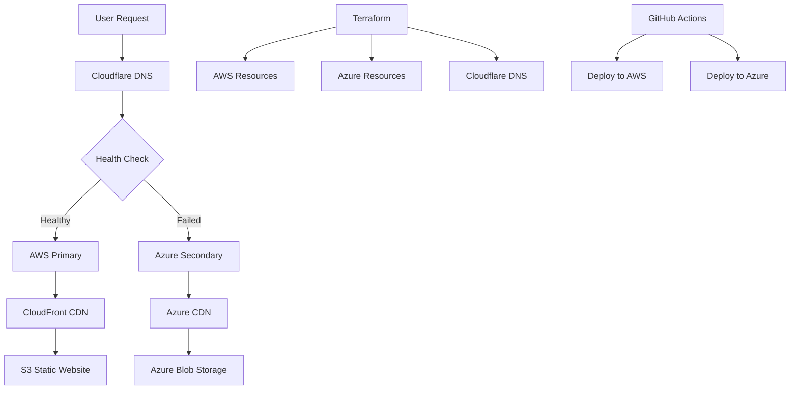

# Multi-Cloud Weather Tracker - Disaster Recovery Architecture

**Professional Multi-Cloud Application with Automated Failover**

A production-ready weather tracking application demonstrating enterprise-grade disaster recovery across AWS and Azure, featuring automated failover, Infrastructure as Code, and multi-cloud deployment strategies.

## 🎯 Quick Overview for Recruiters

**Key Technical Highlights:**

- **Frontend:** Vanilla JavaScript + OpenWeatherMap API integration
- **Multi-Cloud Infrastructure:** AWS (Primary) + Azure (Secondary)
- **Infrastructure as Code:** Terraform with multi-provider setup
- **Disaster Recovery:** Automated DNS failover with health checks
- **DNS Management:** Cloudflare with SSL/TLS certificates
- **Deployment:** Cross-cloud CI/CD with GitHub Actions

**Live Demo:** [weather.portfolio.omesh.site](https://weather.portfolio.omesh.site) | **Backup:** [weather.portfolio-backup.omesh.site](https://weather.portfolio-backup.omesh.site)

---

## 🏗️ Architecture Overview



**Disaster Recovery Flow:**

1. **Normal Operation:** Traffic routes to AWS CloudFront (Primary)
2. **Health Monitoring:** Continuous health checks on primary endpoint
3. **Failure Detection:** Health check fails after 3 consecutive failures
4. **Automatic Failover:** DNS switches to Azure CDN (Secondary)
5. **Recovery:** Automatic switch back when AWS recovers

---

## 💼 Technical Implementation

### Frontend Application

- **Vanilla JavaScript** - Lightweight, fast-loading weather app
- **OpenWeatherMap API** - Real-time weather data integration
- **Responsive Design** - Mobile-first CSS with modern styling
- **Progressive Enhancement** - Works without JavaScript
- **Error Handling** - Graceful degradation and user feedback

### AWS Infrastructure (Primary)

- **S3 Static Website Hosting** - Primary content delivery
- **CloudFront Distribution** - Global CDN with edge caching
- **ACM SSL Certificate** - Automated certificate management
- **Origin Access Control** - Secure S3 access
- **Route 53 Health Checks** - Primary endpoint monitoring

### Azure Infrastructure (Secondary)

- **Azure Blob Storage** - Secondary static website hosting
- **Azure CDN** - Content delivery network
- **Resource Group** - Organized resource management
- **Storage Account** - Static website configuration

### Infrastructure as Code

- **Terraform** - Multi-cloud infrastructure provisioning
- **Terraform Cloud** - Remote state management
- **AWS Provider** - Complete AWS resource management
- **Azure Provider** - Azure resource provisioning
- **Cloudflare Provider** - DNS and certificate management

### Disaster Recovery Features

- **Health Check Monitoring** - 30-second interval checks
- **Automatic Failover** - DNS-based traffic switching
- **SSL Certificates** - Valid certificates on both clouds
- **Content Synchronization** - Identical content deployment
- **Manual Override** - Emergency manual failover capability

---

## 📁 Project Structure

```
14-multicloud-weather-tracker/
├── terraform/                  # Infrastructure as Code
│   ├── main.tf                # Multi-cloud resources
│   ├── providers.tf           # Provider configurations
│   ├── variables.tf           # Input variables
│   ├── outputs.tf             # Resource outputs
│   └── modules/               # Reusable modules
│       ├── aws/               # AWS-specific resources
│       └── azure/             # Azure-specific resources
├── frontend/                   # Weather Application
│   ├── index.html             # Main application page
│   ├── script.js              # Weather API integration
│   └── style.css              # Responsive styling
├── scripts/                    # Deployment automation
│   ├── deploy.sh              # Multi-cloud deployment
│   └── test-failover.sh       # Disaster recovery testing
└── DEPLOYMENT-GUIDE.md         # Detailed setup instructions
```

---

## 🚀 Deployment Pipeline

### Multi-Cloud Deployment Process

**Infrastructure Provisioning:**

1. **Terraform Initialization** - Provider setup and state management
2. **AWS Resources** - S3, CloudFront, ACM certificate, health checks
3. **Azure Resources** - Storage account, CDN, resource group
4. **DNS Configuration** - Cloudflare records and failover setup
5. **Certificate Validation** - Automated SSL certificate provisioning

**Application Deployment:**

1. **AWS Deployment** - Sync frontend to S3 primary bucket
2. **Azure Deployment** - Upload to Azure Blob Storage
3. **Content Verification** - Validate deployment on both clouds
4. **Health Check Testing** - Verify failover mechanisms

### Automated CI/CD Workflow

```yaml
name: Multi-Cloud Weather App Deploy
on:
  push:
    branches: [main]
    paths: ['14-multicloud-weather-tracker/**']

jobs:
  deploy:
    runs-on: ubuntu-latest
    steps:
      - name: Deploy to AWS
        run: aws s3 sync frontend/ s3://$AWS_BUCKET/
      - name: Deploy to Azure
        run: az storage blob upload-batch --destination '$web'
```

---

## 🔧 Technical Configuration

### Required Environment Variables

```bash
# AWS Configuration
AWS_ACCESS_KEY_ID=your_aws_access_key
AWS_SECRET_ACCESS_KEY=your_aws_secret_key
AWS_REGION=ap-south-1

# Azure Configuration
AZURE_CLIENT_ID=your_azure_client_id
AZURE_CLIENT_SECRET=your_azure_client_secret
AZURE_TENANT_ID=your_azure_tenant_id

# Cloudflare Configuration
CLOUDFLARE_API_TOKEN=your_cloudflare_token
CLOUDFLARE_ZONE_ID=your_zone_id

# OpenWeatherMap API
OPENWEATHER_API_KEY=your_api_key
```

### Terraform Variables

```hcl
variable "subdomain" {
  description = "Subdomain for weather app"
  type        = string
  default     = "weather.portfolio"
}

variable "aws_region" {
  description = "AWS region for primary deployment"
  type        = string
  default     = "ap-south-1"
}

variable "azure_location" {
  description = "Azure location for secondary deployment"
  type        = string
  default     = "East US"
}
```

---

## 🛡️ Security Implementation

### Multi-Cloud Security Features

**AWS Security:**
- **Origin Access Control** - Restricts direct S3 access
- **IAM Policies** - Least privilege access control
- **SSL/TLS Encryption** - ACM certificate with TLS 1.2+
- **CloudFront Security Headers** - HSTS, CSP, X-Frame-Options

**Azure Security:**
- **Storage Account Security** - HTTPS-only access
- **CDN SSL Termination** - Encrypted content delivery
- **Resource Group Isolation** - Organized security boundaries

**Cloudflare Security:**
- **DDoS Protection** - Automatic threat mitigation
- **SSL/TLS Termination** - Additional encryption layer
- **DNS Security** - DNSSEC and CAA records

---

## 📊 Disaster Recovery Metrics

### Performance Targets

- **Recovery Time Objective (RTO):** < 5 minutes
- **Recovery Point Objective (RPO):** < 1 minute
- **Availability Target:** 99.9% uptime
- **Health Check Frequency:** 30 seconds
- **Failover Threshold:** 3 consecutive failures

### Monitoring & Alerting

- **AWS CloudWatch** - Primary endpoint monitoring
- **Azure Monitor** - Secondary endpoint health
- **Health Check Logs** - Failure detection and recovery
- **DNS Resolution Monitoring** - Failover verification

---

## 💰 Cost Analysis

### AWS Costs (Monthly Estimates)

- **S3 Storage:** $0.023/GB (first 50TB)
- **CloudFront:** $0.085/GB (first 10TB)
- **Route 53 Health Checks:** $0.50/health check
- **ACM Certificate:** Free

### Azure Costs (Monthly Estimates)

- **Blob Storage:** $0.018/GB (hot tier)
- **Azure CDN:** $0.081/GB (first 10TB)
- **Bandwidth:** $0.087/GB (outbound)

### Cloudflare Costs

- **DNS Management:** Free tier
- **SSL Certificate:** Free
- **CDN Services:** Free tier (100GB)

**Total Estimated Cost:** $2-8/month depending on traffic

---

## 🔍 Testing & Validation

### Disaster Recovery Testing

```bash
# Test primary endpoint
curl -I https://weather.portfolio.omesh.site

# Simulate AWS failure
aws cloudfront update-distribution --id DISTRIBUTION_ID --distribution-config file://disabled-config.json

# Monitor DNS failover
watch -n 5 'dig +short weather.portfolio.omesh.site'

# Verify secondary endpoint
curl -I https://weather.portfolio-backup.omesh.site
```

### Automated Testing

- **Health Check Validation** - Continuous endpoint monitoring
- **Content Verification** - Compare content across clouds
- **SSL Certificate Testing** - Validate certificate chains
- **Performance Testing** - Load testing on both endpoints

---

## 📈 Future Enhancements

### Planned Improvements

- **Multi-Region Deployment** - Additional geographic redundancy
- **Database Failover** - Persistent data disaster recovery
- **Automated Rollback** - Intelligent failure recovery
- **Performance Optimization** - Edge computing integration
- **Monitoring Dashboard** - Real-time DR status visualization

### Advanced Features

- **Blue-Green Deployments** - Zero-downtime updates
- **Canary Releases** - Gradual feature rollouts
- **Chaos Engineering** - Proactive failure testing
- **Cost Optimization** - Intelligent resource scaling

---

**Project Demonstrates:** Multi-Cloud Architecture, Disaster Recovery Planning, Infrastructure as Code, Automated Failover, Cross-Cloud Deployment, DNS Management, and Enterprise-Grade Reliability Engineering.