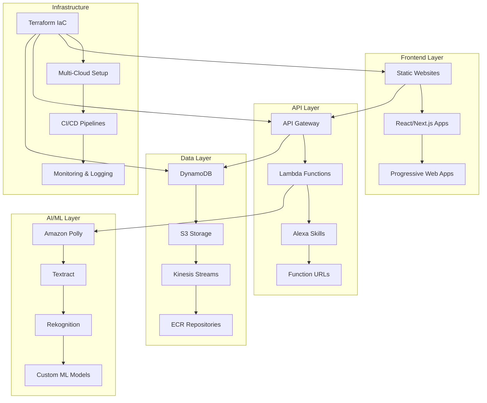
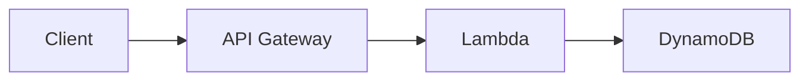

# AWS Portfolio Architecture Diagrams

## Overall Portfolio Architecture



---

## Project 01 - Static Portfolio Website (S3 + CloudFront + Cloudflare)

```
┌─────────────┐    ┌──────────────┐    ┌─────────────┐
│   GitHub    │───▶│ GitHub       │───▶│    AWS S3   │
│ Repository  │    │ Actions      │    │   Bucket    │
│ (React/Vite)│    │   CI/CD      │    │ (Website)   │
└─────────────┘    └──────────────┘    └─────────────┘
                                              │
┌─────────────┐    ┌──────────────┐          │
│ Cloudflare  │◄───│ CloudFront   │◄─────────┘
│    DNS      │    │    (CDN)     │
└─────────────┘    └──────────────┘
       │                  │
       │           ┌──────────────┐
       └──────────▶│     ACM      │
                   │ (SSL Cert)   │
                   └──────────────┘
```

**Tech Stack:** React 19, Three.js, Vite, Terraform
**Live:** [portfolio.omesh.site](https://portfolio.omesh.site)

---

## Project 02 - Mass Email System (Lambda + SES)

```
┌─────────────┐    ┌──────────────┐    ┌─────────────┐
│   GitHub    │───▶│ Manual       │───▶│ AWS Lambda  │
│ Repository  │    │ Deployment   │    │(TypeScript) │
│(TypeScript) │    │              │    │             │
└─────────────┘    └──────────────┘    └─────────────┘
                                              │
┌─────────────┐                              ▼
│ CSV Upload  │────────────────────▶ ┌─────────────────┐
│(email-list) │                     │   Amazon SES    │
└─────────────┘                     │ (Email Service) │
                                    └─────────────────┘
                                              │
                                              ▼
                                   ┌─────────────────┐
                                   │   Recipients    │
                                   │ (Bulk Emails)  │
                                   └─────────────────┘
```

**Tech Stack:** TypeScript, Node.js 18, AWS SDK v3
**Features:** 1000+ emails/batch, CSV processing

---

## Project 03 - Custom Alexa Skill (Voice Interface)

```
┌─────────────┐    ┌──────────────┐    ┌─────────────┐
│    User     │───▶│    Alexa     │───▶│   Alexa     │
│   Voice     │    │   Device     │    │ Developer   │
│  Command    │    │              │    │  Console    │
└─────────────┘    └──────────────┘    └─────────────┘
                                              │
                                              ▼
                                   ┌─────────────────┐
                                   │  AWS Lambda     │
                                   │(Node.js + AI)  │
                                   └─────────────────┘
                                              │
                                              ▼
                                   ┌─────────────────┐
                                   │ Google Gemini   │
                                   │ API (Sassy AI)  │
                                   └─────────────────┘
```

**Tech Stack:** Node.js, Alexa Skills Kit, Google Gemini API
**Features:** Voice-activated portfolio queries, AI personality

---

## Project 04 - Text-to-Speech Generator (Polly)

```
┌─────────────┐    ┌──────────────┐    ┌─────────────┐
│   Client    │───▶│ Lambda       │───▶│ AWS Lambda  │
│ (Frontend)  │    │Function URL  │    │ Function    │
└─────────────┘    └──────────────┘    └─────────────┘
                                              │
                                              ▼
                                   ┌─────────────────┐
                                   │ Amazon Polly    │
                                   │(Text-to-Speech) │
                                   └─────────────────┘
                                              │
                                              ▼
┌─────────────┐                    ┌─────────────────┐
│    AWS S3   │◄───────────────────│   Audio Stream  │
│ (.mp3 files)│                    │   Processing    │
└─────────────┘                    └─────────────────┘
       │
       ▼
┌─────────────┐
│   Public    │
│ S3 URL      │
│ (Response)  │
└─────────────┘
```

**Tech Stack:** Node.js, AWS SDK, Lambda Function URLs
**Features:** Multiple voices, MP3 generation, public URLs

---

## Project 05 - Content Recommendation Engine (Custom ML)

```
┌─────────────┐    ┌──────────────┐    ┌─────────────┐
│   Spotify   │───▶│   Local      │───▶│   Python    │
│  Dataset    │    │ Processing   │    │ ML Models   │
│   (1GB)     │    │              │    │(Scikit-learn)│
└─────────────┘    └──────────────┘    └─────────────┘
                                              │
                                              ▼
                                   ┌─────────────────┐
                                   │ Collaborative   │
                                   │   Filtering     │
                                   │ Recommendations │
                                   └─────────────────┘
```

**Tech Stack:** Python, Pandas, Scikit-learn
**Features:** User-based recommendations, similarity analysis
**Alternative:** Amazon Personalize integration ready

---

## Project 06 - Smart Image Resizer (Next.js + Lambda)

```
┌─────────────┐    ┌──────────────┐    ┌─────────────┐
│  Next.js    │───▶│ API Gateway  │───▶│ AWS Lambda  │
│   UI App    │    │  (/resize)   │    │(Sharp.js)   │
│(shadcn/ui)  │    │              │    │             │
└─────────────┘    └──────────────┘    └─────────────┘
       │                                     │
       │ (Image Upload)                      ▼
       │                          ┌─────────────────┐
       │                          │     Sharp       │
       │                          │ (Image Resize)  │
       │                          └─────────────────┘
       │                                     │
       │                                     ▼
       │                          ┌─────────────────┐
       │                          │    AWS S3       │
       │                          │ (Resized Image) │
       │                          └─────────────────┘
       │                                     │
       │                                     ▼
       └─────────────────────────── ┌─────────────────┐
                                   │  Public S3 URL  │
                                   │   (Download)    │
                                   └─────────────────┘
```

**Tech Stack:** Next.js 15, React 19, Sharp, TypeScript, Tailwind CSS
**Deployment:** Vercel (Frontend) + AWS (Backend)

---

## Project 07 - Automated Receipt Processor (Textract + OCR)

```
┌─────────────┐    ┌──────────────┐    ┌─────────────┐
│   Client    │───▶│    AWS S3    │───▶│ AWS Lambda  │
│(Receipt     │    │   Upload     │    │ Function    │
│ Upload)     │    │              │    │             │
└─────────────┘    └──────────────┘    └─────────────┘
                                              │
                                              ▼
                                   ┌─────────────────┐
                                   │ Amazon Textract │
                                   │ (OCR Service)   │
                                   └─────────────────┘
                                              │
                                              ▼
┌─────────────┐                    ┌─────────────────┐
│  DynamoDB   │◄───────────────────│   Data Parser   │
│(Structured  │                    │   & Extractor   │
│   Data)     │                    └─────────────────┘
└─────────────┘
```

**Tech Stack:** Python, Textract, Lambda, DynamoDB
**Features:** OCR text extraction, expense tracking, data parsing

---

## Project 08 - AI RAG Portfolio Chat (Vector Database)

```
┌─────────────┐    ┌──────────────┐    ┌─────────────┐
│   Client    │───▶│ API Gateway  │───▶│ AWS Lambda  │
│   Query     │    │              │    │(Python+AI) │
└─────────────┘    └──────────────┘    └─────────────┘
                                              │
┌─────────────┐                              ▼
│  Portfolio  │────────────────────▶ ┌─────────────────┐
│ Documents   │                     │   LangChain     │
│(Knowledge   │                     │ + OpenAI API   │
│   Base)     │                     └─────────────────┘
└─────────────┘                              │
                                              ▼
┌─────────────┐                    ┌─────────────────┐
│  DynamoDB   │◄───────────────────│ Vector Embeddings│
│(Vector DB)  │                    │ & RAG Pipeline  │
└─────────────┘                    └─────────────────┘
```

**Tech Stack:** Python, LangChain, OpenAI, Vector Embeddings
**Features:** Conversational AI, document retrieval, context awareness

---

## Project 09 - Amazon Lex Chatbot (Conversational Interface)

```
┌─────────────┐    ┌──────────────┐    ┌─────────────┐
│   Client    │───▶│ Amazon Lex   │───▶│ AWS Lambda  │
│   Chat      │    │   Service    │    │ Function    │
└─────────────┘    └──────────────┘    └─────────────┘
                                              │
                                              ▼
                                   ┌─────────────────┐
                                   │ Intent Recognition│
                                   │ & Slot Filling  │
                                   └─────────────────┘
                                              │
                                              ▼
┌─────────────┐                    ┌─────────────────┐
│  DynamoDB   │◄───────────────────│ Conversation    │
│(Session     │                    │ Management      │
│  State)     │                    └─────────────────┘
└─────────────┘
```

**Tech Stack:** Amazon Lex, Lambda, Natural Language Processing
**Features:** Intent recognition, multi-channel deployment

---

## Project 10 - Kinesis ECR ML Pipeline (Stream Processing)

```
┌─────────────┐    ┌──────────────┐    ┌─────────────┐
│   Docker    │───▶│    AWS ECR   │───▶│   ECS/      │
│ Producer    │    │ (Container   │    │ Container   │
│   App       │    │  Registry)   │    │ Instance    │
└─────────────┘    └──────────────┘    └─────────────┘
                                              │
                                              ▼
┌─────────────┐                    ┌─────────────────┐
│ AWS Lambda  │◄───────────────────│ Kinesis Data    │
│(Consumer)   │                    │   Streams       │
└─────────────┘                    └─────────────────┘
       │                                     ▲
       ▼                                     │
┌─────────────┐                             │
│  DynamoDB   │─────────────────────────────┘
│(Processed   │
│   Data)     │
└─────────────┘
```

**Tech Stack:** Python, Docker, Kinesis, ECR, Lambda
**Features:** Real-time data ingestion, containerized processing

---

## Project 11 - Serverless Image Recognition + Poem Engine

```
┌─────────────┐    ┌──────────────┐    ┌─────────────┐
│   Client    │───▶│    AWS S3    │───▶│ AWS Lambda  │
│(Image       │    │   Upload     │    │(Upload)     │
│ Upload)     │    │              │    │             │
└─────────────┘    └──────────────┘    └─────────────┘
                                              │
                                              ▼
                                   ┌─────────────────┐
                                   │ AWS Rekognition │
                                   │(Image Analysis) │
                                   └─────────────────┘
                                              │
                                              ▼
┌─────────────┐                    ┌─────────────────┐
│   Client    │◄───────────────────│   OpenAI API    │
│(AI Poem     │                    │ (Poem Generator)│
│ Response)   │                    └─────────────────┘
└─────────────┘
```

**Tech Stack:** Python, Rekognition, OpenAI, Lambda
**Features:** Object detection, scene analysis, creative AI poetry

---

## Project 12 - Kubernetes Simple App (Container Orchestration)

```
┌─────────────┐    ┌──────────────┐    ┌─────────────┐
│   Docker    │───▶│ Kubernetes   │───▶│   EKS/      │
│ Containers  │    │   Cluster    │    │ Local K8s   │
│(Node.js/    │    │              │    │             │
│ Python)     │    │              │    │             │
└─────────────┘    └──────────────┘    └─────────────┘
                                              │
┌─────────────┐                              ▼
│   Client    │────────────────────▶ ┌─────────────────┐
│  Request    │                     │ YouTube         │
└─────────────┘                     │ Summarizer      │
                                    │ Microservices   │
                                    └─────────────────┘
```

**Tech Stack:** Node.js, Python, Docker, Kubernetes, Flask
**Features:** Microservices architecture, container orchestration

---

## Project 13 - 2048 Game (AWS CodePipeline CI/CD)

```
┌─────────────┐    ┌──────────────┐    ┌─────────────┐
│   GitHub    │───▶│ AWS Code     │───▶│ AWS Code    │
│ Repository  │    │ Pipeline     │    │ Build       │
│(React Game) │    │              │    │             │
└─────────────┘    └──────────────┘    └─────────────┘
                                              │
┌─────────────┐                              ▼
│ CloudFront  │◄───────────────────▶ ┌─────────────────┐
│    CDN      │                     │    AWS S3       │
└─────────────┘                     │ (Static Site)   │
                                    └─────────────────┘
                                              │
                                              ▼
                                   ┌─────────────────┐
                                   │ Python Flask    │
                                   │   Backend       │
                                   └─────────────────┘
```

**Tech Stack:** React, Vite, Python Flask, Docker, CodePipeline
**Features:** Automated deployment, multi-stage pipeline, testing

---

## Project 14 - Multi-Cloud Weather Tracker (Disaster Recovery)

```
┌─────────────┐    ┌──────────────┐    ┌─────────────┐
│ Cloudflare  │───▶│    AWS       │───▶│ CloudFront  │
│    DNS      │    │  (Primary)   │    │     CDN     │
│             │    │              │    │             │
└─────────────┘    └──────────────┘    └─────────────┘
       │                                     │
       │                                     ▼
       │                          ┌─────────────────┐
       │                          │    AWS S3       │
       │                          │ (Static Site)   │
       │                          └─────────────────┘
       │                                     │
       │                                     ▼
       │                          ┌─────────────────┐
       │                          │ AWS Lambda      │
       │                          │(Weather API)    │
       │                          └─────────────────┘
       │
       ▼
┌─────────────┐
│   Azure     │ (Commented out - Ready for multi-cloud)
│ (Secondary) │
└─────────────┘
```

**Tech Stack:** Vanilla JavaScript, Node.js, Terraform, Cloudflare
**Features:** Automated failover ready, health monitoring, global CDN
**Live:** [weather.portfolio.omesh.site](https://weather.portfolio.omesh.site)

---

## Infrastructure Summary by Service

### **AWS Services Used:**
- **Compute:** Lambda Functions, ECS (Kinesis project)
- **Storage:** S3 Buckets, DynamoDB Tables
- **Networking:** CloudFront, API Gateway, Lambda Function URLs
- **AI/ML:** Polly, Textract, Rekognition
- **Integration:** SES, Kinesis Data Streams, ECR
- **Security:** ACM Certificates, IAM Roles
- **Developer Tools:** CodePipeline, CodeBuild

### **External Services:**
- **DNS:** Cloudflare (Primary DNS provider)
- **Deployment:** Vercel (Next.js apps), GitHub Actions
- **AI APIs:** OpenAI, Google Gemini
- **Containers:** Docker, Kubernetes (EKS/Local)

### **Infrastructure as Code:**
- **Primary:** Terraform (14 projects)
- **Configuration:** .tf files with state management
- **Deployment:** Automated via CI/CD pipelines

---

## Recommended Tools for Visual Diagrams

### 1. **Eraser.io** - Current Tool
- Cloud architecture diagrams
- Code-based diagram generation
- Export to PNG, SVG
- Used for existing project diagrams

### 2. **draw.io (diagrams.net)** - FREE
- Web-based, no installation required
- AWS architecture icons included
- Export to PNG, SVG, PDF
- URL: https://app.diagrams.net/

### 3. **Mermaid** - Code-based
- Markdown-compatible diagrams
- Version control friendly
- GitHub integration
- Used for overview diagram above

### 4. **AWS Architecture Icons**
- Official AWS icon set
- Download: https://aws.amazon.com/architecture/icons/

### Quick Start with Mermaid:
