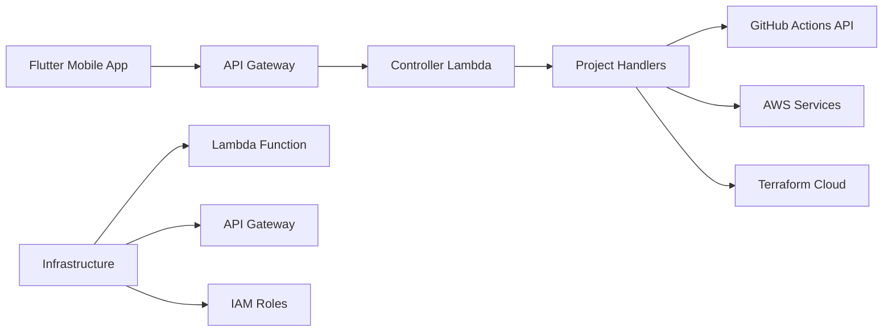

# Main Controller App - Portfolio Management System

**Centralized Project Orchestration with Mobile Interface**

A comprehensive portfolio management system featuring a Python Lambda backend for project coordination and a Flutter mobile app for on-the-go management, demonstrating full-stack development and mobile integration skills.

## 🎯 Quick Overview for Recruiters

**Key Technical Highlights:**
- **Backend:** Python Lambda with API Gateway integration
- **Mobile App:** Flutter cross-platform application
- **Project Management:** Centralized control of all portfolio projects
- **Service Integration:** GitHub Actions, CloudFormation, Terraform APIs
- **Real-time Monitoring:** Live project status and health checks
- **Infrastructure as Code:** Complete Terraform automation

**Live Demo:** Mobile app controlling cloud infrastructure | **Source Code:** [GitHub Repository](https://github.com/your-username/aws-portfolio)

---

## 🏗️ Architecture Overview



**System Flow:**
1. Flutter app sends management requests to API Gateway
2. Controller Lambda routes requests to project-specific handlers
3. Handlers interact with external services (GitHub, AWS, Terraform)
4. Real-time status updates returned to mobile interface
5. Infrastructure managed through Terraform automation

---

## 💼 Technical Implementation

### Backend Architecture
- **Python Lambda** - Serverless request processing
- **Modular Handlers** - Project-specific logic separation
- **Service Integration** - External API coordination
- **Error Handling** - Comprehensive exception management
- **Response Formatting** - Consistent API responses

### Mobile Application
- **Flutter Framework** - Cross-platform development
- **HTTP Client** - RESTful API communication
- **State Management** - Reactive UI updates
- **Material Design** - Professional UI components
- **Real-time Updates** - Live project monitoring

### Service Integrations
- **GitHub Actions** - CI/CD pipeline management
- **AWS Services** - Direct cloud service interaction
- **Terraform Cloud** - Infrastructure state management
- **CloudFormation** - Stack operations and monitoring

---

## 📁 Project Structure

```
Main-controller-app/
├── lambda/                       # Backend Lambda Function
│   ├── handlers/                 # Request Handlers
│   │   ├── projects/             # Project-specific handlers
│   │   │   ├── project_01.py     # Static website management
│   │   │   ├── project_02.py     # Email system control
│   │   │   ├── project_03.py     # Alexa skill management
│   │   │   ├── project_04.py     # Polly TTS control
│   │   │   ├── project_06.py     # Image resizer management
│   │   │   ├── project_10.py     # Kinesis pipeline control
│   │   │   └── utils.py          # Shared utilities
│   │   └── project_handler.py    # Main project router
│   ├── services/                 # External Service Clients
│   │   ├── cloudformation_service.py # AWS CloudFormation
│   │   ├── github_actions_service.py # GitHub CI/CD
│   │   ├── github_service.py     # GitHub API
│   │   └── terraform_service.py  # Terraform operations
│   ├── utils/                    # Utility Functions
│   │   ├── response.py           # Response formatting
│   │   └── router.py             # Request routing
│   ├── lambda_function.py        # Main Lambda handler
│   └── requirements.txt          # Python dependencies
├── flutter-control-app/          # Mobile Application
│   ├── lib/
│   │   └── main.dart             # Flutter application
│   └── pubspec.yaml              # Flutter dependencies
├── infrastructure/               # Terraform Configuration
│   ├── main.tf                   # Core infrastructure
│   ├── lambda.tf                 # Lambda function setup
│   ├── variables.tf              # Configuration variables
│   └── outputs.tf                # Resource outputs
└── README.md                     # This documentation
```

---

## 🚀 Core Functionality

### Main Controller Lambda
```python
from typing import Dict, Any
from utils.router import route_request
from utils.response import error_response

def lambda_handler(event: Dict[str, Any], context: Any) -> Dict[str, Any]:
    """
    Main controller Lambda handler
    Routes requests to appropriate project handlers
    """
    try:
        return route_request(event)
    except Exception as e:
        return error_response(str(e), 500)
```

### Project Handler Example
```python
# handlers/projects/project_01.py - Static Website Handler
import boto3
from services.github_actions_service import GitHubActionsService

def handle_get(event: Dict[str, Any]) -> Dict[str, Any]:
    """
    Get static website project status
    """
    try:
        s3_client = boto3.client('s3')
        cloudfront_client = boto3.client('cloudfront')
        
        bucket_name = 'your-static-website-bucket'
        bucket_info = s3_client.head_bucket(Bucket=bucket_name)
        distributions = cloudfront_client.list_distributions()
        
        return success_response({
            'project': '01-static-website-s3',
            'status': 'active',
            'bucket': bucket_name,
            'last_modified': bucket_info.get('ResponseMetadata', {}).get('HTTPHeaders', {}).get('last-modified'),
            'distributions': len(distributions.get('DistributionList', {}).get('Items', []))
        })
        
    except Exception as e:
        return error_response(f'Failed to get project status: {str(e)}', 500)

def handle_post(event: Dict[str, Any]) -> Dict[str, Any]:
    """
    Trigger project actions (deploy, invalidate, etc.)
    """
    try:
        body = json.loads(event.get('body', '{}'))
        action = body.get('action', 'deploy')
        
        if action == 'deploy':
            github_service = GitHubActionsService()
            result = github_service.trigger_workflow(
                repo='aws-portfolio',
                workflow='01-static-website-deploy.yaml',
                ref='main'
            )
            
            return success_response({
                'message': 'Deployment triggered',
                'workflow_run_id': result.get('id'),
                'status': 'initiated'
            })
            
    except Exception as e:
        return error_response(f'Failed to execute action: {str(e)}', 500)
```

### Flutter Mobile Application
```dart
// lib/main.dart - Flutter Controller App
import 'package:flutter/material.dart';
import 'package:http/http.dart' as http;
import 'dart:convert';

class ProjectDashboard extends StatefulWidget {
  @override
  _ProjectDashboardState createState() => _ProjectDashboardState();
}

class _ProjectDashboardState extends State<ProjectDashboard> {
  List<Project> projects = [];
  bool isLoading = true;

  @override
  void initState() {
    super.initState();
    loadProjects();
  }

  Future<void> loadProjects() async {
    try {
      final response = await http.get(
        Uri.parse('https://your-api-gateway-url/projects'),
        headers: {'Content-Type': 'application/json'},
      );

      if (response.statusCode == 200) {
        final data = json.decode(response.body);
        setState(() {
          projects = (data['projects'] as List)
              .map((p) => Project.fromJson(p))
              .toList();
          isLoading = false;
        });
      }
    } catch (e) {
      setState(() {
        isLoading = false;
      });
      ScaffoldMessenger.of(context).showSnackBar(
        SnackBar(content: Text('Failed to load projects: $e')),
      );
    }
  }

  @override
  Widget build(BuildContext context) {
    return Scaffold(
      appBar: AppBar(
        title: Text('Portfolio Controller'),
        actions: [
          IconButton(
            icon: Icon(Icons.refresh),
            onPressed: loadProjects,
          ),
        ],
      ),
      body: isLoading
          ? Center(child: CircularProgressIndicator())
          : ListView.builder(
              itemCount: projects.length,
              itemBuilder: (context, index) {
                final project = projects[index];
                return ProjectCard(
                  project: project,
                  onAction: (action) => handleProjectAction(project, action),
                );
              },
            ),
    );
  }

  Future<void> handleProjectAction(Project project, String action) async {
    try {
      final response = await http.post(
        Uri.parse('https://your-api-gateway-url/projects/${project.id}'),
        headers: {'Content-Type': 'application/json'},
        body: json.encode({'action': action}),
      );

      if (response.statusCode == 200) {
        ScaffoldMessenger.of(context).showSnackBar(
          SnackBar(content: Text('$action initiated for ${project.name}')),
        );
        loadProjects(); // Refresh project status
      }
    } catch (e) {
      ScaffoldMessenger.of(context).showSnackBar(
        SnackBar(content: Text('Failed to execute $action: $e')),
      );
    }
  }
}
```

### Service Integration Example
```python
# services/github_actions_service.py
import requests
from typing import Dict, Any

class GitHubActionsService:
    def __init__(self):
        self.base_url = "https://api.github.com"
        self.token = os.environ.get('GITHUB_TOKEN')
        self.headers = {
            'Authorization': f'token {self.token}',
            'Accept': 'application/vnd.github.v3+json'
        }

    def trigger_workflow(self, repo: str, workflow: str, ref: str = 'main') -> Dict[str, Any]:
        """
        Trigger GitHub Actions workflow
        """
        url = f"{self.base_url}/repos/{repo}/actions/workflows/{workflow}/dispatches"
        
        payload = {
            'ref': ref,
            'inputs': {}
        }
        
        response = requests.post(url, json=payload, headers=self.headers)
        response.raise_for_status()
        
        return {'status': 'triggered', 'workflow': workflow}

    def get_workflow_runs(self, repo: str, workflow: str) -> Dict[str, Any]:
        """
        Get workflow run history
        """
        url = f"{self.base_url}/repos/{repo}/actions/workflows/{workflow}/runs"
        
        response = requests.get(url, headers=self.headers)
        response.raise_for_status()
        
        return response.json()
```

---

## 🔧 Infrastructure Configuration

### Terraform Setup
```hcl
# Controller Lambda Function
resource "aws_lambda_function" "portfolio_controller" {
  function_name = "portfolio-controller"
  runtime       = "python3.11"
  handler       = "lambda_function.lambda_handler"
  timeout       = 30
  memory_size   = 256

  filename         = "lambda_function.zip"
  source_code_hash = filebase64sha256("lambda_function.zip")

  role = aws_iam_role.controller_lambda_role.arn

  environment {
    variables = {
      GITHUB_TOKEN = var.github_token
      LOG_LEVEL    = "INFO"
    }
  }
}

# API Gateway
resource "aws_api_gateway_rest_api" "controller_api" {
  name        = "portfolio-controller-api"
  description = "API for portfolio project management"

  endpoint_configuration {
    types = ["REGIONAL"]
  }
}

resource "aws_api_gateway_resource" "projects" {
  rest_api_id = aws_api_gateway_rest_api.controller_api.id
  parent_id   = aws_api_gateway_rest_api.controller_api.root_resource_id
  path_part   = "projects"
}

resource "aws_api_gateway_method" "projects_get" {
  rest_api_id   = aws_api_gateway_rest_api.controller_api.id
  resource_id   = aws_api_gateway_resource.projects.id
  http_method   = "GET"
  authorization = "NONE"
}
```

### IAM Permissions
```json
{
    "Version": "2012-10-17",
    "Statement": [
        {
            "Effect": "Allow",
            "Action": [
                "s3:GetObject",
                "s3:ListBucket",
                "s3:PutObject"
            ],
            "Resource": [
                "arn:aws:s3:::portfolio-*",
                "arn:aws:s3:::portfolio-*/*"
            ]
        },
        {
            "Effect": "Allow",
            "Action": [
                "cloudfront:CreateInvalidation",
                "cloudfront:ListDistributions"
            ],
            "Resource": "*"
        },
        {
            "Effect": "Allow",
            "Action": [
                "lambda:InvokeFunction"
            ],
            "Resource": "arn:aws:lambda:*:*:function:portfolio-*"
        }
    ]
}
```

---

## 📊 Features & Capabilities

### Project Management
- **Status Monitoring** - Real-time project health checks
- **Deployment Control** - Trigger CI/CD pipelines
- **Resource Management** - AWS service coordination
- **Configuration Updates** - Environment variable management

### Mobile Interface
- **Cross-platform** - iOS and Android support
- **Responsive Design** - Adaptive UI for different screen sizes
- **Real-time Updates** - Live project status monitoring
- **Offline Support** - Cached data for offline viewing

### Integration Capabilities
- **GitHub Actions** - CI/CD pipeline management
- **AWS Services** - Direct cloud service interaction
- **Terraform** - Infrastructure state management
- **Monitoring** - CloudWatch metrics and alarms

---

## 🚀 Deployment Guide

### Backend Deployment
```bash
# Package Lambda function
cd lambda
zip -r ../lambda_function.zip .

# Deploy infrastructure
cd ../infrastructure
terraform init
terraform plan
terraform apply
```

### Mobile App Development
```bash
# Flutter setup
cd flutter-control-app
flutter pub get
flutter run

# Build for production
flutter build apk --release
flutter build ios --release
```

---

## 🔍 Monitoring & Debugging

### CloudWatch Integration
```python
import boto3
import json

def publish_metrics(action, project_id, success):
    """
    Publish custom metrics to CloudWatch
    """
    cloudwatch = boto3.client('cloudwatch')
    
    cloudwatch.put_metric_data(
        Namespace='PortfolioController',
        MetricData=[
            {
                'MetricName': 'ActionCount',
                'Value': 1,
                'Unit': 'Count',
                'Dimensions': [
                    {
                        'Name': 'Action',
                        'Value': action
                    },
                    {
                        'Name': 'ProjectId',
                        'Value': project_id
                    }
                ]
            },
            {
                'MetricName': 'SuccessRate',
                'Value': 1 if success else 0,
                'Unit': 'Count'
            }
        ]
    )
```

### Debugging Commands
```bash
# Test Lambda function locally
aws lambda invoke --function-name portfolio-controller \
  --payload '{"path":"/projects/01","httpMethod":"GET"}' \
  response.json

# Check API Gateway logs
aws logs filter-log-events \
  --log-group-name /aws/apigateway/portfolio-controller-api

# Monitor Flutter app logs
flutter logs
```

---

## 🎯 Use Cases & Applications

### Development Operations
- **Project Coordination** - Centralized management interface
- **Deployment Automation** - One-click deployments
- **Status Monitoring** - Real-time health checks
- **Resource Management** - Infrastructure lifecycle control

### Mobile Management
- **On-the-go Control** - Mobile project management
- **Emergency Response** - Quick issue resolution
- **Status Dashboard** - Visual project overview
- **Remote Operations** - Manage from anywhere

---

**Component Demonstrates:** Full-Stack Development, Mobile Application Development, API Integration, Project Orchestration, Service Coordination, and Production Management Systems.